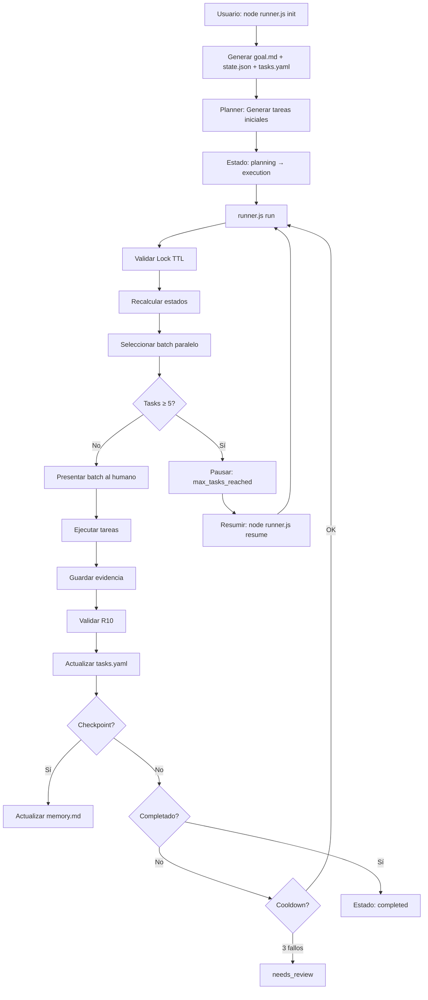

# Sistema de Orquestación de Agentes v3.0

Sistema multi-agente **determinístico y paralelo** donde agentes especializados interactúan entre sí para desarrollar proyectos de software de forma automatizada, con protección contra fatiga de LLM y recuperación ante fallos.

**Actualización v3.0.1**: Ahora con ejecución real de tareas usando LLM, generación de código y escritura automática de archivos.

---

## ✨ Características v3.0

- **🔄 Ejecución Paralela**: Selección declarativa de batches (hasta 3 tareas simultáneas)
- **🛡️ Anti-Hallucination**: Validación R10 (evidencia vs `task.output`) reduce cambios implícitos/no autorizados
- **⚡ Protección Fatiga LLM**: Cooldown tras 3 fallos consecutivos, max 5 tareas por ejecución
- **🔒 Run Lock + TTL**: Previene ejecución concurrente y bloqueos permanentes
- **📊 Determinístico**: Mismo tasks.yaml → mismo batch siempre (priority + id)
- **🧪 30+ Tests**: Validación invariante sin frameworks pesados
- **🤖 Ejecución Real con LLM**: Integración con OpenRouter para generación automática de código
- **📝 Escritura de Archivos**: Parseo automático de JSON y creación de archivos en disco
- **🎯 Modelos Inteligentes**: Selección automática de modelo según tipo de tarea (free, low-cost, premium)

---

## 🔌 Agnóstico por Diseño

Este repo no depende de un proveedor de LLM. El contrato del sistema es:
- `system/tasks.yaml` como interfaz (qué hay que hacer y qué archivos se permiten tocar).
- `skills/` y `agents/*.md` como prompts reutilizables (puedes usarlos con Codex, ChatGPT, Kilo, etc.).
- `runner.js` como orquestador determinístico que valida reglas y propone el siguiente batch.
- `providers/openrouter.js` como bridge para ejecutar tareas con LLM real.

Lo intencionalmente "no agnóstico" son tus *skills* (tu conocimiento codificado). Puedes llevarte el runner a otro repo y cambiar la librería de skills sin tocar el core.

### Integración con OpenRouter

El sistema ahora incluye ejecución automática usando OpenRouter:

```bash
# Configurar API key
echo "OPENROUTER_API_KEY=tu-key" > .env

# Ejecutar tareas automáticamente
node runner.js run
```

El sistema selecciona el modelo óptimo según el skill de la tarea:
- **Free**: minimax-m2.5, qwen3.6-plus, step-3.5-flash
- **Low-cost**: deepseek-v3.2, grok-4.1-fast, kimi-k2.5, qwen3-coder-next
- **Premium**: claude-opus-4.6, gpt-5.3-codex

---

---

## 📁 Estructura del Sistema v3.0

```
ai-orchestrator-base/
├── runner.js              # Entry point - Orquestador determinístico
├── package.json           # Dependencias (js-yaml, dotenv)
├── .env                   # Variables de entorno (API keys)
├── README.md              # Este archivo
├── USAGE.md               # Guía completa de uso
├── system/                # Estado y configuración del sistema
│   ├── goal.md            # Prompt inicial del usuario (inmutable)
│   ├── plan.md            # Plan estructurado en fases
│   ├── plan_request.md    # Solicitud de planner (contexto barato)
│   ├── tasks.yaml         # Tareas con input/output (YAML v3.0)
│   ├── state.json         # Control de ejecución (mínimo)
│   ├── memory.md          # Decisiones técnicas (append-only)
│   ├── context.md         # Resumen corto del estado (cheap context)
│   ├── status.md          # Dashboard compacto (progreso, riesgos)
│   ├── config.json        # Configuración de límites y modelos
│   └── events.log         # Auditoría de eventos
│   └── runs/              # Historial por ejecución (gitignored)
│   ├── skills_index.json  # Índice de skills (generado)
│   ├── provider.json      # Proveedor activo (generado)
│   ├── cost.json          # Presupuesto y gasto (generado)
│   └── splits/            # Sugerencias de split (generado)
│   └── evidence/          # Evidencias de ejecución (task_id.json)
├── providers/             # Integraciones con proveedores LLM
│   └── openrouter.js      # Bridge para OpenRouter API
├── agents/                # Definición de agentes
│   ├── planner.md         # Genera tasks.yaml desde goal
│   ├── executor.md        # Ejecuta tareas usando skills
│   ├── qa.md              # Valida output (PASS/FAIL)
│   ├── reviewer.md        # Evalúa calidad (Score 1-10)
│   └── checkpoint.md      # Resume progreso en checkpoints
│   └── prompts/            # Scaffolds de prompts por rol
├── templates/             # Templates de modulos
│   └── modules/
├── domain-packs/          # Packs para dominios no-dev
├── skills/                # Biblioteca de skills por categoría
│   ├── frontend/
│   ├── backend/
│   ├── database/
│   ├── testing/
│   ├── devops/
│   ├── security/
│   ├── architecture/
│   ├── cognitive/
│   └── classifier/
└── tests/                 # Tests invariantes
    ├── run-all.js
    ├── phase1_state.test.js
    ├── phase4_batch.test.js
    ├── phase10_recalc.test.js
    ├── phase11-14_validation.test.js
    ├── phase15-17_final.test.js
    ├── phase18_simulation.test.js
    ├── phase_attempts.test.js
    ├── phase_memory_compaction.test.js
    └── phase_corrective_tasks.test.js
```

---

## 🚀 Comandos CLI

```bash
# Instalar dependencias
npm ci

# Configurar API key para ejecución automática
echo "OPENROUTER_API_KEY=tu-key" > .env

# Inicializar nuevo proyecto
node runner.js init "Descripción del proyecto"

# Ejecutar una ronda (hasta 5 tareas, con LLM si hay API key)
node runner.js run

# Reanudar desde estado pausado
node runner.js resume

# Ver estado actual
node runner.js status

# Modo revisión manual
node runner.js review

# Ejecutar tests
npm test

# Refrescar snapshot de contexto
node runner.js context

# Crear solicitud de planner (usa goal + context)
node runner.js plan "Tu solicitud"

# Validar tasks.yaml contra config
node runner.js validate

# Indexar skills y buscar
node runner.js skills
node runner.js skills search "frontend"

# Sugerir split de tarea grande
node runner.js split T1

# Seleccionar proveedor
node runner.js provider list
node runner.js provider use openrouter

# Presupuesto y gasto
node runner.js cost set 50
node runner.js cost add 1.25

# Marcar tarea como done (auto evidencia si hay git diff)
node runner.js done T1

# Marcar tarea como fail
node runner.js fail T1 "motivo"

# Reintentar tarea
node runner.js retry T1

# Validar evidencias
node runner.js verify

# Crear evidencia manual/auto
node runner.js evidence T1 src/file.js
```

Nota: `tasks.yaml` se guarda con orden determinístico y bloqueos optimistas para evitar colisiones entre ediciones paralelas.

### Ejecución Automática con LLM

Cuando hay una API key de OpenRouter configurada, el sistema:
1. Selecciona el modelo óptimo según el skill de la tarea
2. Genera el código automáticamente
3. Escribe los archivos en disco
4. Actualiza tasks.yaml con el estado
5. Crea evidencia automática

---

## 📋 Formato tasks.yaml v3.0

```yaml
version: "3.0"
generated_at: "2024-01-01T00:00:00Z"
run_id: "my-project-20240101"

tasks:
  - id: "T1"
    title: "Setup base de datos"
    description: "Crear esquema PostgreSQL"
    skill: "database/postgres-schema"
    estado: "done"        # pending | running | done | failed | blocked
    priority: 1           # 1 = alta, 3 = baja
    depends_on: []        # IDs de tareas dependientes
    created_at: "2024-01-01T00:00:00Z"
    updated_at: "2024-01-01T00:00:00Z"
    attempts: 0
    max_attempts: 3
    input:
      - "docs/schema.md"
    output:
      - "src/database/"
      - "migrations/"

metadata:
  total_tasks: 1
  completed: 1
  pending: 0
  failed: 0
  blocked: 0
```

---

## 🔐 Límites de Ejecución (Anti-Fatiga)

| Límite | Valor | Descripción |
|--------|-------|-------------|
| `max_tasks_per_run` | 5 | Tareas máximas por ejecución |
| `max_iterations` | 50 | Iteraciones máximas totales |
| `cooldown_threshold` | 3 | Fallos consecutivos para pausa |
| `lock_ttl_seconds` | 1800 | TTL del Run Lock (30 min) |
| `max_batch_size` | 3 | Tareas paralelas por batch |

---

## 🧪 Testing

Tests invariantes sin frameworks pesados:

```bash
# Ejecutar todos los tests
npm test

# Salida esperada:
# === Running All Tests ===
# Testing Phase 1: State Schema...
# ✅ Phase 1 tests passed
# ...
# === ALL TESTS PASSED ===
```

**Fases testeadas:**
- Phase 1: State Schema (simplificado, no duplicación)
- Phase 4: Batch Selection (paralelo, determinístico)
- Phase 10: Recalculation Rule (estados desde dependencias)
- Phase 11-14: Validaciones (R9, completion, deps, R10)
- Phase 15-17: Features finales (lock TTL, determinismo, R11)
- Phase 18: Simulaciones (workflows completos)

---

## ✅ Estado Actual y Limitaciones

**Fortalezas:**
- Orquestación determinística y auditable (events.log + status.md + runs history).
- Evidencia automática y validación estricta (R10 + verify).
- Concurrencia segura con lock optimista en `tasks.yaml`.
- Contexto barato (`context.md`) para reducir costos de lectura.
- **Ejecución automática con LLM**: Integración con OpenRouter para generación de código.
- **Escritura de archivos**: Parseo automático de JSON y creación de archivos en disco.
- **Selección inteligente de modelos**: Configuración por skill para optimizar costo/calidad.

**Limitaciones actuales:**
- La evidencia automática depende de `git diff --name-only` (si no hay git o no hay diff, requiere archivos explícitos).
- Proveedores y costo son estado local (no conectan con APIs de billing todavía).

**Listo para pruebas fuertes:**
- Sí, a nivel de orquestación, validaciones y flujos SDD, con tests pasando.
- Recomendado: pruebas de carga con múltiples editores en `tasks.yaml` y repos grandes para validar locks y performance.

---

## 🔄 Flujo de Trabajo v3.0



---

## 📊 Reglas de Seguridad

### R9: Límite de Tamaño de Tarea
- **Tiempo**: < 15 minutos ejecución humana
- **Archivos**: Modifica < 10 archivos
- **Objetivo**: Meta única y enfocada

### R10: Sin Tareas Implícitas (Anti-Hallucination)
- Executor SOLO puede crear/modificar archivos en `task.output`
- Evidencia validada contra output permitido
- Reduce cambios implícitos/no autorizados (y obliga a explicitar qué se tocó)

### R11: Protección del Planner (Anti-Destrucción)
- Planner solo puede ejecutar si:
  - `tasks.yaml` no existe, O
  - `state.phase === "planning"`
- Previene regeneración accidental que destruye progreso

---

## 🛡️ Recuperación ante Fallos

### Stale Lock Detection
```javascript
// Si el lock tiene > 1800 segundos, se limpia automáticamente
validateLock(state); // [WARN] STALE LOCK DETECTED - clearing
```

### Resumir Ejecución
```bash
# Si se pausó por max_tasks_per_run
node runner.js resume

# Resetea contadores y continúa
```

### Revisión Manual
```bash
# Si entra en modo needs_review
node runner.js review
```

---

## 📈 Ejemplo de Ejecución

```bash
$ node runner.js init "Crear API REST con autenticación JWT"
[INIT] New run initialized: crear-api-rest-con-autenticacion-jwt-20240303
[INIT] Phase: planning
[INIT] Tasks template created

$ node runner.js run
[RUN] Starting execution...
[STATE] Phase: execution
[STATE] Iteration: 0/50

🟢 BATCH PARALELO - Puedes ejecutar estas tareas en cualquier orden:
  - T1: Setup base de datos
    Input: docs/schema.md
    Output: src/database/, migrations/
  - T2: Crear modelo User
    Input: src/database/
    Output: src/models/User.js

# ... después de completar tareas ...

$ node runner.js status
[STATUS] Current run state
- run_id: crear-api-rest-con-autenticacion-jwt-20240303
- version: 3.0
- phase: execution
- iteration: 5/50
- status: running
- tasks_completed: 5/5
- consecutive_failures: 0

$ node runner.js resume
[RESUME] Reset counters and continuing...
```

---

## 🔧 Configuración

El runner lee `system/config.json`. Soporta un bloque `limits` (opcional) para ajustar topes, y `evidence` para enforcement.

```json
{
  "version": "3.0",
  "limits": {
    "max_tasks_per_run": 5,
    "max_iterations": 50,
    "checkpoint_interval": 5,
    "max_batch_size": 3,
    "cooldown_threshold": 3
  },
  "context": {
    "max_memory_entries": 20,
    "compaction_enabled": true,
    "max_lines": 120,
    "working_set_limit": 10
  },
  "evidence": {
    "required": true,
    "min_files_changed": 1
  },
  "tasks": {
    "id_pattern": "^T\\d+(_fix)?$"
  },
  "providers": {
    "kilo": {
      "type": "kilo",
      "base_url": ""
    }
  },
  "active_provider": "kilo",
  "cost_budget": {
    "max_usd": 50
  },
  "retention": {
    "events_max_lines": 2000,
    "evidence_max_days": 30
  },
  "review_hooks": {
    "auto_run": false,
    "commands": ["npm test"]
  },
  "redaction": {
    "enabled": true
  }
}
```

---

## 📚 Documentación Adicional

- [`USAGE.md`](USAGE.md) - Guía completa de uso
- [`TECHNICAL.md`](TECHNICAL.md) - Documentación técnica y arquitectura
- [`plans/v3-deterministic-parallel-orchestrator-plan.md`](plans/v3-deterministic-parallel-orchestrator-plan.md) - Plan de implementación v3.0
- [`agents/planner.md`](agents/planner.md) - Definición del Planner
- [`agents/checkpoint.md`](agents/checkpoint.md) - Definición del Checkpoint Agent

---

## ✅ Criterios de Éxito v3.0

- [x] Estado de tareas SOLO en tasks.yaml (no duplicado en state.json)
- [x] State.json mínimo (run_id, iteration, status, execution_control, lock)
- [x] Run Lock previene ejecución concurrente
- [x] Hasta 5 tareas por ejecución
- [x] Contadores de sesión resetean en `resume` (y al iniciar un run nuevo)
- [x] Batch selection recalculado cada ejecución
- [x] max_iterations = 50 detiene ejecución
- [x] Sin while loops - ejecución single-round
- [x] Tareas con campos input/output definidos
- [x] Formato de evidencia mínimo
- [x] Checkpoint actualiza memory.md
- [x] Regla de recálculo ejecuta antes de cada run
- [x] Límites de tamaño de tarea (R9)
- [x] Validación de dependencias (existencia + ciclos)
- [x] Detección automática de completitud
- [x] R10: Validación de evidencia vs task.output
- [x] Lock TTL previene deadlocks permanentes
- [x] Ordenamiento determinístico de batches
- [x] R11: Guardrail del Planner
- [x] Tests invariantes para todas las fases críticas
- [x] `npm test` pasa antes de commit
- [x] **Ejecución automática con LLM** (v3.0.1)
- [x] **Escritura de archivos en disco** (v3.0.1)
- [x] **Configuración de modelos por skill** (v3.0.1)
- [x] **Evidencia automática con metadata** (v3.0.1)

---

## 📝 Changelog

### v3.0.1 - LLM Execution (2026-04-06)
- **Ejecución Real con LLM**: Integración con OpenRouter para ejecutar tareas automáticamente
- **Escritura de Archivos**: Parseo automático de JSON y creación de archivos en disco
- **Configuración de Modelos**: Sistema de mapeo de skills a modelos (free, low-cost, premium)
- **Evidencia Automática**: Creación de evidence files con metadata de ejecución
- **dotenv Support**: Carga de API keys desde archivo .env
- **Nuevos Modelos**:
  - Free: minimax-m2.5, qwen3.6-plus, step-3.5-flash
  - Low-cost: deepseek-v3.2, grok-4.1-fast, kimi-k2.5, qwen3-coder-next
  - Premium: claude-opus-4.6, gpt-5.3-codex

### v3.1 - Improvements (2026-03-06)
- **Mejora 1**: Tareas correctivas - Soporte para T5 → T5_fix sin mutar originales
- **Mejora 2**: Attempts/Max Attempts - Control de reintentos con failed_permanent
- **Mejora 3**: Memory Compaction - Auto-compacta cuando excede 20 entradas
- **Mejora 5**: Skills cognitivas - problem-analyzer, solution-evaluator, dependency-reasoner
- **Mejora 6**: Architecture skills - system-design, api-design, db-boundaries
- 50+ tests invariantes

### v3.0 - Deterministic Parallel Orchestrator
- Refactor completo a arquitectura paralela
- Nuevo formato tasks.yaml con input/output
- Límites de ejecución (max_tasks_per_run, max_iterations)
- Sistema de cooldown con consecutive_failures
- Run Lock con TTL para recuperación ante fallos
- R9: Validación de tamaño de tarea
- R10: Validación anti-hallucination
- R11: Guardrail anti-destrucción del planner
- 30+ tests invariantes

### v2.0 - Sequential Loop-Based Runner
- Orquestador basado en while loop
- Formato tasks.md
- Iteraciones ilimitadas

### v1.0 - Initial Release
- Sistema multi-agente básico
- Agentes: Planner, Executor, QA, Reviewer

---

**Desarrollado con ❤️ por Carlos Gallardo**
