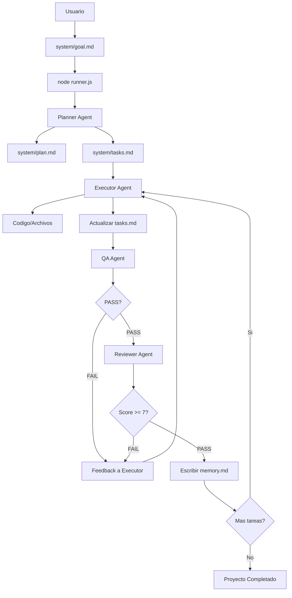

#  Sistema de Orquestacion de Agentes v1.0

Sistema multi-agente donde agentes especializados interactuan entre si para desarrollar proyectos de software de forma automatizada.

---

##  Estructura del Sistema

```
.ai/                          # Directorio raiz del sistema
 system/                   # Estado y configuracion del sistema
    goal.md              #  Prompt inicial del usuario (inmutable)
    plan.md              #  Plan estructurado en fases (generado por Planner)
    tasks.md             #  Lista de tareas con estado (generado por Planner)
    memory.md            #  Decisiones tecnicas + razonamiento (append-only)
    state.json           #  Fase actual, iteracion, errores, metricas
    config.json          #  Skills habilitados, stacks, constraints

 agents/                   #  Definicion de agentes con plantillas dinamicas
    planner.md           #  Genera plan.md + tasks.md desde goal
    executor.md          #  Ejecuta tareas usando skills
    qa.md                #  Valida output antes de reviewer (PASS/FAIL)
    reviewer.md          #  Evalua calidad despues de QA PASS (Score 1-10)
    orchestrator.md      #  Define el flujo del sistema

 skills/                   #  Biblioteca de skills por categoria
    frontend/
       react-hooks.md              # Basico
       vue-composition.md          # Basico
       animations.md               # Estandar
       design-awwwards.md          # Premium (Awwwards-level)
       design-taste.md             # Premium+ (High-end)
       animations-expert.md        # Expert (Animaciones complejas)
       performance-expert.md       # Expert (Optimizacion)
       ux-accessibility.md         # Professional (Accesibilidad)
    backend/
       dotnet-data-sqlserver.md
       laravel-api.md
       node-api.md
    database/
       postgres-schema.md          # Estandar
       migrations-dotnet-prisma.md # Estandar
       prisma-queries.md           # Basico
       postgresql-expert.md        # Expert
       sqlserver-expert.md         # Expert
    testing/
       backend-test.md
    devops/
       docker.md
       ci-cd.md
       deployment.md
    security/
       api-security.md
    architecture/
        global-architect.md

 runner.js                 #  Entry point - Orquesta el flujo de agentes
 USAGE.md                  #  Guia completa de uso
```

---

##  Flujo de Trabajo



**Flujo correcto:** Executor  **QA**  **Reviewer**  Memory  Done

### Contrato Estandar de Estado por Tarea

En `system/tasks.md` (columna `resultado`) cada agente debe agregar tokens para que el runner avance:

- Executor: `executor:done`
- QA: `qa:pass` o `qa:fail`
- Reviewer: `review:pass(score=X)` o `review:fail(score=X)`
- Memory: al registrar la tarea en `system/memory.md`, el runner la marca `done`

Validaciones automaticas de `tasks.md`:
- Columnas minimas: `id`, `estado`, `resultado`
- `id` valido: `T001`, `T002`, etc.
- `estado` valido: `pending`, `running`, `done`, `failed`, `skipped`
- Sin `id` duplicados
- Dependencias validas (si usas `dependencias`/`dependencies`/`depends_on`/`deps`): sin referencias inexistentes, sin autoreferencia y sin ciclos

---

##  Como Usar

### 1. Iniciar Proyecto

```bash
# Desde el directorio .ai
node runner.js "Tu objetivo aqui"
```

### 1.1 Inicializar proyecto limpio (recomendado)

```bash
# Resetea goal/plan/tasks/state para un nuevo proyecto
node scripts/init-project.js "Tu objetivo aqui"
```

Despues ejecuta:

```bash
node runner.js
```

**Ejemplos:**
```bash
# Landing page
node runner.js "Landing page para restaurante, hero, menu, contacto"

# API REST
node runner.js "API REST para e-commerce con auth JWT, productos, ordenes"

# Base de datos
node runner.js "Esquema PostgreSQL para app de citas medicas"
```

### 2. Flujo de Agentes

El runner indica que agente ejecutar. Tu lo ejecutas en el chat de Kilo.ai:

| Paso | En Terminal | En Chat de Kilo.ai |
|------|-------------|-------------------|
| 1 | `node runner.js "goal"` | - |
| 2 | Muestra: " Activating Planner..." | Escribe prompt del Planner Agent |
| 3 | Muestra: " Activating Executor..." | Escribe prompt del Executor Agent |
| 4 | Muestra: " Activating QA..." | Escribe prompt del QA Agent |
| 5 | Muestra: " Activating Reviewer..." | Escribe prompt del Reviewer Agent |
| 6 | Repetir desde paso 3 | - |

### 3. Prompts Listos

**Planner Agent:**
```
Actua como el Planner Agent. Lee system/goal.md y genera:
1. system/plan.md con las fases
2. system/tasks.md con las tareas usando variables {{task_id}}, {{skill_name}}
```

**Executor Agent:**
```
Actua como el Executor Agent. Lee system/tasks.md y ejecuta la siguiente tarea pending:
- Usa el skill asignado desde skills/
- Genera codigo/archivos
- Actualiza tasks.md a "done"
- Escribe decisiones en memory.md
```

**QA Agent:**
```
Actua como el QA Agent. Valida el output del Executor:
- Aplica checks especificos del skill
- Si hay issues criticos  FAIL
- Si todo OK  PASS
- Genera QA Report
```

**Reviewer Agent:**
```
Actua como el Reviewer Agent. Evalua calidad despues de QA PASS:
- Score 1-10 por criterios (Funcionalidad 30%, Calidad 20%, etc.)
- Si score >= 7  PASS  tarea DONE
- Si score < 7  FAIL  vuelve a Executor
- Escribe notas en memory.md
```

---

##  Agentes

### Planner Agent
**Rol:** Recibe goal.md  genera plan.md + tasks.md

**Plantillas:** Usa variables como {{run_id}}, {{task_id}}, {{skill_name}}

### Executor Agent
**Rol:** Ejecuta tareas usando skills especificos

**Input:** Tarea de tasks.md + skill desde skills/ + memory.md

**Output:** Codigo + tasks.md actualizado + memory.md

### QA Agent
**Rol:** Valida output ANTES del reviewer

**Checks por tipo:**
- Frontend: TypeScript sin errores, sin console.log, props tipadas
- Backend: Error handling, no secrets, validacion inputs
- Database: Migrations reversibles, indices, no N+1

**Regla:** 1+ issue critico = FAIL automatico

### Reviewer Agent
**Rol:** Evalua calidad DESPUES de QA PASS

**Criterios:**
- Funcionalidad (30%): Hace lo que pedia?
- Calidad de codigo (20%): Sigue patrones del skill?
- Consistencia (20%): Respeta memory.md?
- Testabilidad (15%): Es verificable?
- Alignment con goal (15%): Contribuye al objetivo?

**Regla:** Score < 7 = FAIL, vuelve a Executor

---

##  Estados del Sistema

### Fases

| Phase | Descripcion | Agente Activo |
|-------|-------------|---------------|
| `init` | Setup inicial | Runner |
| `planning` | Generar plan y tareas | Planner |
| `execution` | Ejecutar tareas | Executor  QA  Reviewer |
| `complete` | Proyecto terminado | Runner |

### Estados de Tareas

```
pending  running  done
                
                  failed
```

### Estados de QA

- **PASS:** Continua a Reviewer
- **FAIL:** Vuelve a Executor con issues criticos

### Estados de Review

- **PASS (Score >= 7):** Tarea DONE, escribe memory
- **FAIL (Score < 7):** Vuelve a Executor con feedback

---

##  Configuracion

Ver [`system/config.json`](system/config.json):

### Niveles de Proyecto (Tiers)

El sistema selecciona automaticamente el tier segun palabras clave en el goal:

| Tier | Triggers | Skills | Para que proyectos |
|------|----------|--------|-------------------|
| **basic** | Por defecto | Estandar | MVP, landing simple, prototipo rapido |
| **professional** | "accessible", "scalable", "corporate" | +Accesibilidad, +Seguridad | E-commerce, SaaS, corporativo |
| **premium** | "awwwards", "premium", "luxury", "enterprise" | +Design-taste, +Animations-expert, +Performance-expert | Awwwards-level, enterprise, high-traffic |

**Ejemplos de deteccion:**
```bash
"Landing para restaurante"  Tier: basic
"Landing awwwards-level"  Tier: premium  
"E-commerce accesible"  Tier: professional
"Dashboard con animaciones GSAP"  Tier: premium
```

### Complejidad de Tareas

Cada tarea tiene un nivel de complejidad (1-4):
- **1** - Basic: Componentes simples, CRUD estandar
- **2** - Standard: Interacciones medianas, integraciones API
- **3** - Advanced: Animaciones complejas, estados globales
- **4** - Expert: Arquitectura escalable, micro-interacciones premium

---

##  Documentacion Adicional

- [`USAGE.md`](USAGE.md) - Guia completa con ejemplos por tipo de proyecto
- [`agents/planner.md`](agents/planner.md) - Definicion del Planner
- [`agents/executor.md`](agents/executor.md) - Definicion del Executor
- [`agents/qa.md`](agents/qa.md) - Definicion del QA
- [`agents/reviewer.md`](agents/reviewer.md) - Definicion del Reviewer
- [`system/SKILL_EVOLUTION.md`](system/SKILL_EVOLUTION.md) - Flujo para convertir aprendizajes en skills reusables
- [`system/SKILL_CHANGELOG.md`](system/SKILL_CHANGELOG.md) - Historial versionado de cambios de skills
- [`system/skill-proposals/TEMPLATE.md`](system/skill-proposals/TEMPLATE.md) - Plantilla de propuesta para mejorar una skill

---

##  Troubleshooting

**"No tasks found"**
- El Planner no genero tareas. Ejecuta Planner Agent nuevamente.

**Sistema HALTED**
- Revisa `system/state.json`  `halt_reason`
- Corrige el problema
- Cambia `"halted": false` y vuelve a ejecutar `node runner.js`

**Tarea falla repetidamente**
- Revisa QA Report y Review para entender el problema
- Actualiza el skill si el patron no es adecuado
- Divide la tarea en subtareas mas pequenas

---

##  Tips

1. **Goals especificos:** Cuanto mas detalle, mejor el plan
2. **Revisa memory.md:** Contiene decisiones importantes
3. **Skills personalizables:** Edita los archivos en `skills/` para adaptar patrones
4. **Itera rapido:** Corre `node runner.js` frecuentemente para ver el estado


