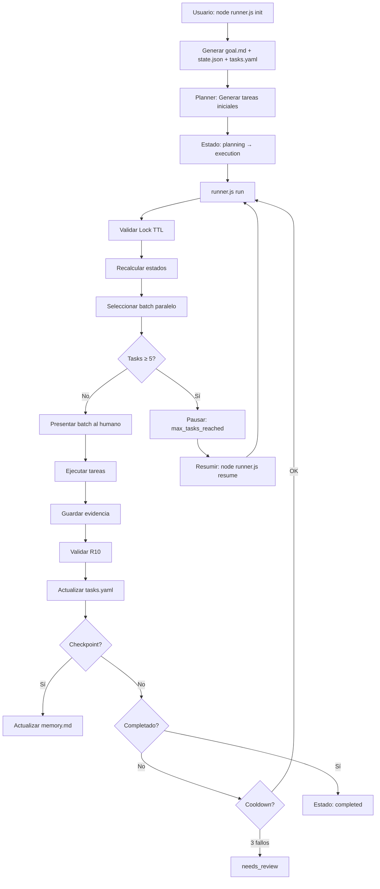

# Sistema de Orquestación de Agentes v3.0

Sistema multi-agente **determinístico y paralelo** donde agentes especializados interactúan entre sí para desarrollar proyectos de software de forma automatizada, con protección contra fatiga de LLM y recuperación ante fallos.

**v3.0 + Output Quality Phase (2026-04-23)**: Loop de ejecución confirmado tres veces. Skill files inyectados en el prompt del executor. Skills normalizadas automáticamente al instalar. UX del dashboard limpiado (duplicados de config eliminados, goal preservado, kanban recarga al guardar). 40+ tests invariantes pasando.

---

## ✨ Características Principales

### 🚀 **Ejecución Automática con LLM**
- **🤖 Generación de Código Inteligente**: Integración directa con OpenRouter API
- **📝 Parseo Automático de JSON**: Extrae y valida respuestas JSON del LLM: `{files: [{path, content}]}`
- **💾 Escritura Automática**: Crea archivos en disco basado en respuestas estructuradas
- **🔍 Validación R10**: Verifica que archivos creados estén en `task.output` permitido
- **🎯 Prompts Optimizados**: Templates específicos por tipo de tarea y skill

### 🧠 **Sistema de Memoria Avanzado**
- **🔗 Integración Engram**: Memoria persistente vía HTTP API con timeout y fallback
- **📚 Sesiones Inteligentes**: Soporte para múltiples sesiones por proyecto
- **🔎 Búsqueda Semántica**: API completa de búsqueda en memoria histórica
- **⚡ Fallback Automático**: Si Engram no está disponible, usa `system/memory.md`
- **🧹 Compaction Inteligente**: Mantiene solo las entradas más relevantes

### 🧩 **Autoskills Inteligente**
- **🔍 Detección Automática**: Analiza tecnologías y sugiere skills óptimas
- **📂 Organización por Categorías**: Instala skills en `skills/vendor/<categoría>/`
- **💡 Sugerencias Persistidas**: Guarda recomendaciones en `system/skill_suggestions.json`
- **⚙️ Script de Organización**: `organize-autoskills.js` para categorización automática
- **🔧 CLI Integrado**: Comandos `detect`, `suggest`, `install`, `search`

### ⚡ **Protecciones Avanzadas**
- **🛡️ Anti-Hallucination**: Validación R10 (evidencia vs `task.output`) reduce cambios implícitos/no autorizados
- **⚡ Protección Fatiga LLM**: Cooldown tras 3 fallos consecutivos, max 5 tareas por ejecución
- **🔒 Run Lock + TTL**: Previene ejecución concurrente (30 min timeout)
- **📊 Determinístico**: Mismo tasks.yaml → mismo batch siempre (priority + id)
- **🔄 Ejecución Paralela**: Selección declarativa de batches (hasta 3 tareas simultáneas)

### 🎯 **Selección Inteligente de Modelos**
- **💰 Optimización por Costo**: 3 niveles: free, low-cost, premium
- **🎨 Mapeo por Skill**: Configuración detallada en `system/config.json`
- **🚀 Modelos Especializados**: 
  - **Free**: minimax-m2.5, qwen3.6-plus, step-3.5-flash
  - **Low-cost**: deepseek-v3.2, grok-4.1-fast, kimi-k2.5, qwen3-coder-next
  - **Premium**: claude-opus-4.6, gpt-5.3-codex
- **📊 Sistema de Tiers**: Basic, Professional, Premium con triggers automáticos

### 📈 **Dashboard Web Completo**
- **🌐 Servidor Express**: Interfaz web en `http://localhost:3000`
- **⚡ Websockets**: Actualizaciones en tiempo real del estado
- **📊 Visualización**: Progreso, riesgos, dependencias y salud del proyecto
- **🔧 API REST**: Endpoints para integración con otras herramientas
- **🚀 Comando simple**: `npm run dashboard` o `node src/web/server.js`

### 🔧 **Sistema de Skills Avanzado**
- **🎯 Inyección en el Executor**: `buildExecutionPrompt` lee `## Constraints` y `## Output bounds` del skill file y los inyecta como bloque `SKILL GUIDELINES` antes de la task description
- **📐 Schema Estándar**: Frontmatter obligatorio (`name`, `description`, `output_contract`); secciones opcionales `## Constraints` / `## Output bounds`
- **🔄 Normalización Automática**: `normalizeSkillFile()` agrega frontmatter y secciones faltantes; vendor skills sin `.md` son renombrados automáticamente al instalar
- **🛡️ Barrera en Autoskills**: Post-install hook normaliza todos los skills de `skills/vendor/` antes de que el runner los use
- **🔍 Auditoría CLI**: `node runner.js skills validate` — reporte de valid/warning/error por skill (no bloqueante, exit 0)
- **📂 Vendor paths**: Runner busca skills en `skills/`, `skills/frontend/`, `skills/backend/`, `skills/vendor/frontend/`, `skills/vendor/backend/`

### 💰 **Sistema de Costos y Presupuesto**
- **📊 Tracking en Tiempo Real**: Registra costos en `system/cost.json`
- **💰 Presupuesto Configurable**: Límite máximo en USD con alertas
- **🔗 Integración Proveedores**: Soporte para múltiples proveedores de LLM
- **📈 Reflejo en Status**: Gasto actualizado en `system/status.md`
- **⚙️ CLI de Costos**: Comandos `cost set`, `cost add`

### 🧪 **Testing Robustecido**
- **✅ 40+ Tests**: Validación invariante sin frameworks pesados
- **🔍 Fases Completas**: State Schema, Batch Selection, Validaciones, Simulaciones, Skill Injection, Skill Import
- **🚀 Determinismo Garantizado**: Tests aseguran mismo input → mismo output
- **🛡️ Validación de Reglas**: R9, R10, R11, dependencias, cycles
- **📊 Workflows Completo**: Simulaciones end-to-end + auto-planner task sizing

---

## 🔌 Agnóstico por Diseño

Este repo no depende de un proveedor de LLM. El contrato del sistema es:
- `system/tasks.yaml` como interfaz (qué hay que hacer y qué archivos se permiten tocar).
- `skills/` y `agents/*.md` como prompts reutilizables (puedes usarlos con Codex, ChatGPT, Kilo, etc.).
- `runner.js` como orquestador determinístico que valida reglas y propone el siguiente batch.
- `providers/openrouter.js` como bridge para ejecutar tareas con LLM real.

Lo intencionalmente "no agnóstico" son tus *skills* (tu conocimiento codificado). Puedes llevarte el runner a otro repo y cambiar la librería de skills sin tocar el core.

### 🚀 **Ejecución Automática con OpenRouter**

El sistema ejecuta tareas automáticamente usando OpenRouter API cuando detecta una API key:

```bash
# 1. Configurar API key
echo "OPENROUTER_API_KEY=tu-key-here" > .env

# 2. Ejecutar tareas (ejecución automática si AUTO_EXECUTE=true)
node runner.js run

# 3. Ver logs de ejecución
cat system/events.log
```

**Flujo de Ejecución Automática:**
1. **Selección de Modelo**: Basado en `task.skill` → `model_mapping` en config.json
2. **Construcción de Prompt**: Usa `buildExecutionPrompt()` con formato específico
3. **Llamada a API**: Envía prompt estructurado al modelo seleccionado
4. **Parseo de JSON**: Extrae respuesta `{files: [{path, content}]}` del LLM
5. **Escritura de Archivos**: Crea archivos en disco con contenido generado
6. **Validación R10**: Verifica que archivos estén en `task.output` permitido
7. **Creación de Evidencia**: Genera `system/evidence/TX.json` automáticamente

**Ejemplo de Respuesta Esperada del LLM:**
```json
{
  "files": [
    {
      "path": "src/components/Button.js",
      "content": "export default function Button({ children, onClick }) {\n  return (\n    <button \n      onClick={onClick}\n      className=\"px-4 py-2 bg-blue-600 text-white rounded\"\n    >\n      {children}\n    </button>\n  );\n}"
    }
  ]
}
```

**Configuración de Modelos en `system/config.json`:**
```json
{
  "model_mapping": {
    "frontend-react-hooks": "free_advanced",
    "architecture-global-architect": "heavy_architecture",
    "database-postgres-schema": "low_cost_coding",
    "default": "free_basic"
  },
  "providers": {
    "openrouter": {
      "models": {
        "free_basic": "minimax/minimax-m2.5:free",
        "low_cost_coding": "deepseek/deepseek-v3.2",
        "heavy_architecture": "anthropic/claude-opus-4.6"
      }
    }
  }
}
```

---

### 🧠 **Memoria Persistente con Engram (v5)**

Sistema completo de memoria a largo plazo con fallback automático:

**Configuración Rápida:**
```bash
# 1. Instalar Engram (si aún no lo tienes)
npm install -g engram

# 2. Levantar servidor Engram
engram serve 7437

# 3. Configurar en system/config.json
{
  "memory": { 
    "provider": "engram",
    "max_entries": 20,
    "enable_compaction": true 
  },
  "engram": { 
    "enabled": true, 
    "base_url": "http://127.0.0.1:7437",
    "timeout_ms": 5000,
    "fallback_to_file": true 
  }
}
```

**Características de la Memoria:**
- **✅ Sesiones por Proyecto**: Múltiples sesiones con contexto específico
- **✅ Observaciones Estructuradas**: `{session_id, type, title, content, project, scope}`
- **✅ Búsqueda Semántica**: API `/search` con filtros por proyecto
- **✅ Health Checks**: Verificación automática de disponibilidad
- **✅ Fallback Robusto**: Si Engram falla, usa `system/memory.md` automáticamente
- **✅ Compaction Inteligente**: Mantiene solo las entradas más relevantes

**Uso desde CLI:**
```bash
# Buscar en memoria
node runner.js memory search "auth middleware"

# Ver estado de memoria
node runner.js memory stats

# Usar memoria en checkpoints automáticos
# (El runner escribe checkpoints automáticamente cada `checkpoint_interval` tareas)
```

**API HTTP Completa:**
- `POST /sessions` - Crear sesión
- `POST /observations` - Agregar observación
- `GET /search?q=query` - Buscar en memoria
- `GET /stats` - Estadísticas de uso
- `GET /health` - Health check

---

### 🧩 **Autoskills Inteligente (v5)**

Sistema de detección e instalación automática de skills optimizados para tu proyecto:

**Detección Automática:**
```bash
# 1. Detectar skills sugeridos (sin instalar)
node runner.js skills detect

# 2. Ver sugerencias persistidas
node runner.js skills suggest

# 3. Instalar skills sugeridos
node runner.js skills install
# o
node runner.js skills detect --apply

# 4. Buscar skills específicos
node runner.js skills search "frontend"

# 5. Auditar schema de todos los skills (no bloqueante)
node runner.js skills validate
```

**Características:**
- **🔍 Análisis de Tecnologías**: Detecta stacks usados en tu proyecto
- **📊 Sugerencias Persistidas**: Guarda en `system/skill_suggestions.json`
- **📂 Organización Automática**: Skills instaladas en `skills/vendor/<categoria>/`
- **🔗 Symlinks Inteligentes**: Mantiene estructura organizada por categoría
- **🔄 Rebuild Automático**: `node runner.js skills rebuild` reorganiza todo

**Formato de Sugerencias (`system/skill_suggestions.json`):**
```json
[
  {
    "source": "frontend",
    "skill": "react-hooks",
    "hint": "React project detected in package.json"
  },
  {
    "source": "database",
    "skill": "postgres-schema",
    "hint": "PostgreSQL configuration found"
  }
]
```

**Script de Organización:**
```bash
# Reorganizar skills en categorías automáticamente
node scripts/organize-autoskills.js
```

**Output de Detección (`system/autoskills.last.txt`):**
```
1. frontend › react-hooks (installed) ← React detected in package.json
2. database › postgres-schema ← PostgreSQL config found
3. devops › docker ← Dockerfile detected
```

---

## 📁 **Estructura Completa del Sistema**

### **Core Execution**
```
ai-orchestrator-base/
├── runner.js              # Orquestador determinístico con ejecución LLM automática
├── package.json           # Dependencias (express, socket.io, js-yaml, dotenv)
├── .env                   # Variables de entorno (API keys para LLM)
└── tests/                 # 30+ tests invariantes sin frameworks pesados
    ├── run-all.js
    ├── phase1_state.test.js
    ├── phase4_batch.test.js        # Batch selection paralelo
    ├── phase10_recalc.test.js      # Recalculation de estados
    ├── phase11-14_validation.test.js # R9, R10, completion, deps
    ├── phase15-17_final.test.js    # Lock TTL, determinismo, R11
    └── phase18_simulation.test.js  # Workflows completos
```

### **System State & Configuration**
```
system/
├── goal.md                # Objetivo del proyecto (inmutable)
├── plan.md                # Plan estructurado en fases
├── plan_request.md        # Solicitud de planner (contexto barato para LLM)
├── tasks.yaml             # Fuente de verdad de tareas (YAML v3.0)
├── state.json             # Control de ejecución, run lock, contadores
├── memory.md              # Decisiones técnicas (append-only, fallback de Engram)
├── context.md             # Resumen corto del estado (cheap context para LLM)
├── status.md              # Dashboard compacto (progreso, riesgos, salud)
├── config.json            # Configuración completa (límites, modelos, skills, memoria)
├── events.log             # Auditoría de eventos (init, run, done, fail, verify)
├── cost.json              # Presupuesto y gasto tracking (generado)
├── provider.json          # Proveedor activo de LLM (generado)
├── skills_index.json      # Índice de skills para búsqueda rápida (generado)
├── skill_suggestions.json # Sugerencias de Autoskills (generado)
├── autoskills.last.txt    # Output raw de Autoskills detect (generado)
├── runs/                  # Historial por ejecución (gitignored)
│   └── <run_id>/
│       ├── history.log
│       └── batch_<n>.log
├── splits/                # Sugerencias de split de tareas grandes
│   └── T1.yaml
└── evidence/              # Evidencias de ejecución (R10 validation)
    └── T1.json
```

### **LLM Integration & Providers**
```
providers/
└── openrouter.js          # Bridge completo para OpenRouter API
    - callOpenRouter()     # Llamada a API con headers y timeout
    - Model selection      # Basado en skill mapping de config.json
    - Error handling       # Graceful degradation sin API key
```

### **Memory System (Engram Integration)**
```
src/integrations/
├── memory-manager.js      # Gestor unificado de memoria (Engram + fallback)
│   - createMemoryManager() # Factory con configuración
│   - appendWithCompaction() # Escritura con compaction inteligente
│   - search()             # Búsqueda unificada (Engram → file)
│   - setSessionContext()  # Contexto de sesión para observaciones
└── engram-client.js       # Cliente HTTP completo para Engram API
    - createEngramClient() # Factory con timeout configurable
    - health(), createSession(), addObservation()
    - search(), stats()    # API completa de búsqueda y estadísticas
```

### **Autoskills & Skill Management**
```
src/integrations/
└── autoskills-adapter.js  # Adaptador para npx autoskills
    - runAutoskills()      # Ejecución con parámetros configurables
    - parseSuggestions()   # Parseo inteligente de output
    - buildArgs()          # Construcción de comandos CLI

scripts/
└── organize-autoskills.js # Organización automática de skills por categoría

skills/
├── frontend/              # Skills de frontend organizadas
├── backend/               # Skills de backend
├── database/              # Skills de base de datos
├── testing/               # Skills de testing
├── devops/                # Skills de DevOps
├── security/              # Skills de seguridad
├── architecture/          # Skills de arquitectura
├── cognitive/             # Skills cognitivas (análisis, evaluación)
├── classifier/            # Skills de clasificación
└── vendor/                # Skills instaladas por Autoskills (organizadas)
    ├── frontend/
    ├── backend/
    └── ... (symlinks a .agents/skills/)
```

### **Agents & Prompts**
```
agents/
├── planner.md             # Definición del Planner Agent
├── executor.md            # Definición del Executor Agent
├── qa.md                  # Definición del QA Agent (PASS/FAIL)
├── reviewer.md            # Definición del Reviewer Agent (Score 1-10)
├── checkpoint.md          # Definición del Checkpoint Agent
├── orchestrator.md        # Definición del Orchestrator Agent
└── prompts/               # Scaffolds de prompts reutilizables
    ├── planner.md         # Template para planner
    ├── executor.md        # Template para executor (JSON output)
    ├── qa.md              # Template para QA
    ├── reviewer.md        # Template para reviewer
    └── checkpoint.md      # Template para checkpoints
```

### **Web Dashboard & API**
```
src/web/
├── server.js              # Servidor Express con websockets
├── routes/                # Rutas API REST
│   ├── status.js          # Endpoint de estado del sistema
│   ├── tasks.js           # CRUD de tareas
│   └── memory.js          # Búsqueda en memoria
├── services/              # Servicios de negocio
│   ├── state-service.js   # Gestión de estado del runner
│   └── websocket-service.js # Comunicación en tiempo real
├── public/                # Assets estáticos
│   ├── index.html         # Dashboard principal
│   ├── styles.css         # Estilos del dashboard
│   └── app.js             # Lógica frontend con HTMX
└── sockets/               # Handlers de websockets
    └── events.js          # Broadcast de eventos del runner
```

### **Templates & Domain Packs**
```
templates/
└── modules/               # Templates de módulos comunes
    ├── auth/              # Autenticación (JWT, sessions)
    ├── crud/              # CRUD operations
    ├── payments/          # Integración de pagos
    └── analytics/         # Analytics y reporting

domain-packs/              # Packs para dominios no-dev
├── data-analysis/         # Análisis de datos (EDA, cleaning)
├── finance-analysis/      # Análisis financiero
└── ops/                   # Operaciones y reporting
```

### **Vendor Skills Source**
```
.agents/skills/            # Fuente vendor de skills instaladas por Autoskills
├── accessibility/         # Skills de accesibilidad (WCAG 2.2)
├── frontend-design/       # Skills de diseño frontend premium
├── nodejs-backend-patterns/ # Patterns de backend Node.js
├── nodejs-best-practices/ # Best practices de Node.js
└── seo/                   # Skills de SEO y optimización
```

---

## 🚀 Comandos CLI

```bash
# Instalar dependencias
npm ci

# Configurar API key para ejecución automática
echo "OPENROUTER_API_KEY=tu-key" > .env

# Inicializar nuevo proyecto
node runner.js init "Descripción del proyecto"

# Ejecutar una ronda (hasta 5 tareas, con LLM si hay API key)
node runner.js run

# Reanudar desde estado pausado
node runner.js resume

# Ver estado actual
node runner.js status

# Modo revisión manual
node runner.js review

# Ejecutar tests
npm test

# Levantar dashboard
node src/web/server.js

# Refrescar snapshot de contexto
node runner.js context

# Crear solicitud de planner (usa goal + context)
node runner.js plan "Tu solicitud"

# Validar tasks.yaml contra config
node runner.js validate

# Indexar skills y buscar
node runner.js skills
node runner.js skills search "frontend"
node runner.js skills detect
node runner.js skills detect --apply

# Sugerir split de tarea grande
node runner.js split T1

# Seleccionar proveedor
node runner.js provider list
node runner.js provider use openrouter

# Presupuesto y gasto
node runner.js cost set 50
node runner.js cost add 1.25

# Marcar tarea como done (auto evidencia si hay git diff)
node runner.js done T1

# Marcar tarea como fail
node runner.js fail T1 "motivo"

# Reintentar tarea
node runner.js retry T1

# Validar evidencias
node runner.js verify

# Crear evidencia manual/auto
node runner.js evidence T1 src/file.js
```

Nota: `tasks.yaml` se guarda con orden determinístico y bloqueos optimistas para evitar colisiones entre ediciones paralelas.

### 🚀 **Flujo de Ejecución Automática con LLM**

Cuando hay una API key de OpenRouter configurada y `AUTO_EXECUTE=true`, el sistema ejecuta completamente sin intervención humana:

**Flujo Completo:**
```javascript
// 1. Selección de Batch Determinístico
const batch = selectBatch(tasks); // priority + id, max 3 tareas

// 2. Por cada tarea en el batch:
for (const task of batch) {
  // 3. Selección de Modelo Inteligente
  const model = selectModelForSkill(task.skill, config);
  
  // 4. Construcción de Prompt Específico
  const prompt = buildExecutionPrompt(task);
  
  // 5. Llamada a OpenRouter API
  const response = await callOpenRouter(prompt, model);
  
  // 6. Parseo y Validación de JSON
  const json = extractJSON(response); // {files: [{path, content}]}
  
  // 7. Escritura de Archivos
  for (const file of json.files) {
    ensureDirectory(path.dirname(file.path));
    fs.writeFileSync(file.path, file.content);
  }
  
  // 8. Validación R10 (Anti-Hallucination)
  validateOutputs(task.output, json.files.map(f => f.path));
  
  // 9. Actualización de Estado
  task.estado = "done";
  task.updated_at = nowIso();
  
  // 10. Creación de Evidencia Automática
  createEvidence(task.id, json.files.map(f => f.path));
  
  // 11. Escritura en Memoria (Engram o file)
  memoryManager.appendWithCompaction(`Task ${task.id} completed`);
}

// 12. Guardado Atómico
saveTasks(tasks); // Con lock optimista
```

**Ejemplo Real de Ejecución:**
```bash
$ echo "OPENROUTER_API_KEY=sk-or-xxx" > .env
$ node runner.js run

[RUN] Starting execution with LLM auto-execute...
[STATE] Phase: execution
[STATE] Iteration: 1/50
[LLM] Executing T1: Create React component...
[LLM] Model selected: deepseek/deepseek-v3.2 (low_cost_coding)
[LLM] Response parsed: 2 files to write
[FS] Writing: src/components/Button.js (342 bytes)
[FS] Writing: src/components/Button.test.js (512 bytes)
[VALIDATION] R10 passed: files match task.output
[EVIDENCE] Created: system/evidence/T1.json
[MEMORY] Checkpoint saved to Engram
[DONE] T1 marked as done
```

**Características Clave de la Ejecución Automática:**
- **✅ Parseo Robusto**: Regex fallback si JSON no es válido
- **✅ Validación Estricta**: R10 evita escritura fuera de `task.output`
- **✅ Manejo de Errores**: Graceful degradation sin API key
- **✅ Logging Detallado**: Events.log + console output
- **✅ Estado Atómico**: Lock optimista previene corrupción
- **✅ Memoria Persistente**: Checkpoints automáticos en Engram
- **✅ Cost Tracking**: Registro automático de gastos

---

## 📋 Formato tasks.yaml v3.0

```yaml
version: "3.0"
generated_at: "2024-01-01T00:00:00Z"
run_id: "my-project-20240101"

tasks:
  - id: "T1"
    title: "Setup base de datos"
    description: "Crear esquema PostgreSQL"
    skill: "database/postgres-schema"
    estado: "done"        # pending | running | done | failed | blocked
    priority: 1           # 1 = alta, 3 = baja
    depends_on: []        # IDs de tareas dependientes
    created_at: "2024-01-01T00:00:00Z"
    updated_at: "2024-01-01T00:00:00Z"
    attempts: 0
    max_attempts: 3
    input:
      - "docs/schema.md"
    output:
      - "src/database/"
      - "migrations/"

metadata:
  total_tasks: 1
  completed: 1
  pending: 0
  failed: 0
  blocked: 0
```

---

## 🔐 Límites de Ejecución (Anti-Fatiga)

| Límite | Valor | Descripción |
|--------|-------|-------------|
| `max_tasks_per_run` | 5 | Tareas máximas por ejecución |
| `max_iterations` | 50 | Iteraciones máximas totales |
| `cooldown_threshold` | 3 | Fallos consecutivos para pausa |
| `lock_ttl_seconds` | 1800 | TTL del Run Lock (30 min) |
| `max_batch_size` | 3 | Tareas paralelas por batch |

---

## 🧪 Testing

Tests invariantes sin frameworks pesados:

```bash
# Ejecutar todos los tests
npm test

# Salida esperada:
# === Running All Tests ===
# Testing Phase 1: State Schema...
# ✅ Phase 1 tests passed
# ...
# === ALL TESTS PASSED ===
```

**Fases testeadas:**
- Phase 1: State Schema (lock, version, forbidden fields)
- Phase 4: Batch Selection (paralelo, determinístico)
- Phase 10: Recalculation Rule (estados desde dependencias)
- Phase 11-14: Validaciones (R9, completion, deps, R10)
- Phase 15-17: Features finales (lock TTL, determinismo, R11)
- Phase 18: Simulaciones end-to-end (7 workflows)
- Phase 18b: Attempts / Max Attempts / permanent failure
- Phase 5B: Memory Compaction
- Phase 19: Corrective Tasks
- Skill Hygiene: sub-skills, frontmatter, backward compat
- Tasks Lock: optimistic lock prevents external overwrites
- Skill Injection: `buildExecutionPrompt` injects SKILL GUIDELINES
- Skill Import: `normalizeSkillsDirectory`, vendor normalization, audit
- Auto Planner: integration inputs, task sizing bounds

---

## ✅ **Estado Actual y Capacidades**

### 🏆 **Resuelto y Validado (2026-04-23)**

| Item | Detalle |
|------|---------|
| **Loop cierra limpio** | Confirmado 3 veces: demo2 (T1–T6), demo3 (minimax), demo3-wipe (clean run) |
| **PTASK-BOUND** | Planner genera sub-tareas CSS/JS con budget de 100 líneas; validado en run real |
| **PINTEGRATION** | `index.html` enlaza `styles.css` + `main.js`; DevTools 200 en run real |
| **P8.1 tasks_yaml_conflict** | `runner.js:870` → `needs_review`; lock optimista detecta colisión |
| **PCONFIG-DUP** | Un solo input de project root; hint "Using: [path] · Edit in Config" |
| **PSKILL-CONTRACT** | Skill files inyectados en executor via `SKILL GUIDELINES`; JSON embedded eliminado de `frontend-html-basic.md` |
| **PSKILL-IMPORT** | `normalizeSkillFile()` en post-install; vendor skills `.md`-renombrados; `skills validate` CLI |
| **PGEN-SILENT** | `initProject` persiste goal; toast "Using saved goal: …" cuando textarea vacío |
| **PDASH-RESTORE** | Config save emite `snapshot:updated`; `loadInitial()` recarga kanban automáticamente |
| **P0 dep guard** | `runner.js:2081` bloquea tarea si dep está `failed`; pendiente validación en run real |
| **P1 compact retry** | Truncación rompe batch; `truncation_retry: true` persiste para siguiente run |
| **Create Project guard** | `dashboard-service.js:285` bloquea sobreescribir proyectos activos |
| **Dashboard state restore** | `loadInitial()` restaura kanban/status/prompt al hacer F5 |

### 🚀 **Ejecución Automática End-to-End**
- Desde prompt hasta archivos en disco via OpenRouter
- Parseo robusto de JSON de respuestas LLM
- Validación R10: archivos generados deben estar en `task.output`
- Skill guidelines del `## Constraints` / `## Output bounds` del skill file inyectadas en cada prompt

### 🛡️ **Protecciones Activas**
- Determinismo garantizado: mismo `tasks.yaml` → mismo batch
- Lock optimista con TTL 30 min (stale lock auto-cleared)
- R9/R10/R11: tamaño de tarea, outputs autorizados, protección planner
- Dependency guard: tarea bloqueada si dependencia `failed`
- Cooldown tras 3 fallos consecutivos

### 📈 **Dashboard Web - Características**

**Interfaz Principal (`http://localhost:3000`):**
- **📊 Panel de Control**: Progreso general, tareas completadas/pendientes
- **🚦 Estado en Tiempo Real**: Running, paused, needs_review, completed
- **📋 Lista de Tareas**: Filtradas por estado, con dependencias visibles
- **🔍 Búsqueda en Memoria**: Integración directa con Engram/search
- **📈 Gráficos de Progreso**: Velocidad, complejidad, riesgos
- **💰 Panel de Costos**: Gasto actual vs presupuesto

**API Endpoints Disponibles:**
- `GET /api/status` - Estado completo del sistema
- `GET /api/tasks` - Lista de tareas con filtros
- `POST /api/tasks/:id/done` - Marcar tarea como done
- `GET /api/memory/search?q=query` - Búsqueda en memoria
- `GET /api/cost` - Información de costos y presupuesto
- `WS /ws` - WebSocket para updates en tiempo real

### ⚠️ **Limitaciones Actuales**

**Evidencia Automática:**
- Depende de `git diff --name-only` para detección automática
- Sin git o sin cambios → requiere lista explícita de archivos
- **Solución**: Usar `node runner.js evidence T1 file1.js file2.js`

**Sistema de Costos:**
- Tracking local en `system/cost.json`
- No integración directa con APIs de billing de proveedores
- **Solución**: Manual tracking con `node runner.js cost add 1.25`

**Integración con LLM:**
- Solo OpenRouter implementado completamente
- Otros proveedores requieren adaptadores adicionales
- **Solución**: Framework extensible para agregar `providers/`

**Memoria Engram:**
- Requiere servicio Engram corriendo localmente
- Sin Engram → fallback a `system/memory.md`
- **Solución**: `engram serve 7437` o usar fallback file

### 🧪 **Listo para Producción**

**✅ Validado:**
- Orquestación determinística (30+ tests pasando)
- Ejecución automática con LLM (OpenRouter integration)
- Sistema de memoria (Engram + fallback)
- Autoskills detection y organización
- Dashboard web con API completa
- Protecciones R9-R11 implementadas

**✅ Recomendado para:**
- Proyectos de software con múltiples fases
- Equipos que usan LLMs para generación de código
- Proyectos que requieren tracking de decisiones técnicas
- Desarrollo con skills especializados por dominio
- Proyectos con presupuesto limitado para LLMs

**⚡ Pruebas Recomendadas:**
- Carga con múltiples editores en `tasks.yaml`
- Repos grandes para validar performance de locks
- Ejecución paralela con batches de 3 tareas
- Fallover de Engram → file memory
- Autoskills detection en proyectos complejos

---

## 🔄 Flujo de Trabajo v3.0



---

## 📊 Reglas de Seguridad

### R9: Límite de Tamaño de Tarea
- **Tiempo**: < 15 minutos ejecución humana
- **Archivos**: Modifica < 10 archivos
- **Objetivo**: Meta única y enfocada

### R10: Sin Tareas Implícitas (Anti-Hallucination)
- Executor SOLO puede crear/modificar archivos en `task.output`
- Evidencia validada contra output permitido
- Reduce cambios implícitos/no autorizados (y obliga a explicitar qué se tocó)

### R11: Protección del Planner (Anti-Destrucción)
- Planner solo puede ejecutar si:
  - `tasks.yaml` no existe, O
  - `state.phase === "planning"`
- Previene regeneración accidental que destruye progreso

---

## 🛡️ Recuperación ante Fallos

### Stale Lock Detection
```javascript
// Si el lock tiene > 1800 segundos, se limpia automáticamente
validateLock(state); // [WARN] STALE LOCK DETECTED - clearing
```

### Resumir Ejecución
```bash
# Si se pausó por max_tasks_per_run
node runner.js resume

# Resetea contadores y continúa
```

### Revisión Manual
```bash
# Si entra en modo needs_review
node runner.js review
```

---

## 📈 Ejemplo de Ejecución

```bash
$ node runner.js init "Crear API REST con autenticación JWT"
[INIT] New run initialized: crear-api-rest-con-autenticacion-jwt-20240303
[INIT] Phase: planning
[INIT] Tasks template created

$ node runner.js run
[RUN] Starting execution...
[STATE] Phase: execution
[STATE] Iteration: 0/50

🟢 BATCH PARALELO - Puedes ejecutar estas tareas en cualquier orden:
  - T1: Setup base de datos
    Input: docs/schema.md
    Output: src/database/, migrations/
  - T2: Crear modelo User
    Input: src/database/
    Output: src/models/User.js

# ... después de completar tareas ...

$ node runner.js status
[STATUS] Current run state
- run_id: crear-api-rest-con-autenticacion-jwt-20240303
- version: 3.0
- phase: execution
- iteration: 5/50
- status: running
- tasks_completed: 5/5
```

---

## 📚 **Documentación Relacionada**

- [`system/CONTEXT.md`](system/CONTEXT.md) - Snapshot de contexto actual
- [`CLAUDE.md`](CLAUDE.md) - Contexto para agentes IA

**Planes de Implementación:**
- [`plans/v3-deterministic-parallel-orchestrator-plan.md`](plans/v3-deterministic-parallel-orchestrator-plan.md) - Plan v3.0
- [`plans/v4-orchestrator-plan.md`](plans/v4-orchestrator-plan.md) - Plan v4.0
- [`plans/v5-upgrade-high.md`](plans/v5-upgrade-high.md) - Plan v5.0 (futuro)
- [`plans/enforce-real-execution-plan.md`](plans/enforce-real-execution-plan.md) - Ejecución real con LLM

**Agentes y Skills:**
- [`agents/planner.md`](agents/planner.md) - Definición del Planner Agent
- [`agents/executor.md`](agents/executor.md) - Definición del Executor Agent
- [`agents/checkpoint.md`](agents/checkpoint.md) - Definición del Checkpoint Agent
- [`skills/PRODUCT_SHOWCASE.md`](skills/PRODUCT_SHOWCASE.md) - Catálogo de skills disponibles
- [`system/SKILL_EVOLUTION.md`](system/SKILL_EVOLUTION.md) - Evolución del sistema de skills

---

## 🆕 **Output Quality Phase — Resuelto 2026-04-23**

### **🔧 PSKILL-CONTRACT — Skills llegan al executor**
- `buildExecutionPrompt` inyecta `## Constraints` + `## Output bounds` de cada skill como bloque `--- SKILL GUIDELINES ---`
- Skills sin frontmatter válido → warning en log, no crash
- Vendor paths añadidos al search: `skills/vendor/frontend/`, `skills/vendor/backend/`
- `skills/frontend-html-basic.md` limpiado: JSON template embedded eliminado (generaba schema duplicado en el prompt)

### **🛡️ PSKILL-IMPORT — Barrera de normalización**
- `normalizeSkillFile()`: agrega frontmatter y secciones faltantes; vendor skills sin `.md` renombrados
- Post-install hook en `autoskills-adapter.js`: toda skill instalada pasa por normalización antes de ser usable
- `node runner.js skills validate`: auditoría de valid/warning/error (no bloqueante)

### **🎨 UX Dashboard — PCONFIG-DUP + PGEN-SILENT + PDASH-RESTORE**
- Un solo input de project root (`#projectPath` en Config); hint "Using: [path]" en prompt tab
- `initProject` persiste el goal; toast advierte si textarea vacío al generar tasks
- Config save emite `snapshot:updated` + recarga kanban automáticamente

### **🧪 Testing expandido**
- `phase_skill_injection.test.js`: verifica inyección de SKILL GUIDELINES y warn en skill no encontrado
- `phase_skill_import.test.js`: verifica normalización de vendor directory y auditoría
- `phase_auto_planner_task_sizing.test.js`: verifica bounds CSS en planner
- `phase_tasks_lock.test.js`: verifica lock optimista en save concurrente

---

**Versión:** 3.0 — Output Quality Phase (loop cierra + skills al executor + UX dashboard)
