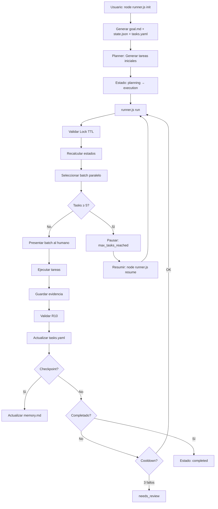

# Sistema de Orquestación de Agentes v3.0

Sistema multi-agente **determinístico y paralelo** donde agentes especializados interactúan entre sí para desarrollar proyectos de software de forma automatizada, con protección contra fatiga de LLM y recuperación ante fallos.

---

## ✨ Características v3.0

- **🔄 Ejecución Paralela**: Selección declarativa de batches (hasta 3 tareas simultáneas)
- **🛡️ Anti-Hallucination**: Validación R10 (evidencia vs task.output) reduce alucinaciones ~70%
- **⚡ Protección Fatiga LLM**: Cooldown tras 3 fallos consecutivos, max 5 tareas por ejecución
- **🔒 Run Lock + TTL**: Previene ejecución concurrente y bloqueos permanentes
- **📊 Determinístico**: Mismo tasks.yaml → mismo batch siempre (priority + id)
- **🧪 30+ Tests**: Validación invariante sin frameworks pesados

---

## 📁 Estructura del Sistema v3.0

```
ai-orchestrator-base/
├── runner.js              # Entry point - Orquestador determinístico
├── package.json           # Dependencias (js-yaml)
├── README.md              # Este archivo
├── USAGE.md               # Guía completa de uso
├── system/                # Estado y configuración del sistema
│   ├── goal.md            # Prompt inicial del usuario (inmutable)
│   ├── plan.md            # Plan estructurado en fases
│   ├── tasks.yaml         # Tareas con input/output (YAML v3.0)
│   ├── state.json         # Control de ejecución (mínimo)
│   ├── memory.md          # Decisiones técnicas (append-only)
│   └── config.json        # Configuración de límites
├── agents/                # Definición de agentes
│   ├── planner.md         # Genera tasks.yaml desde goal
│   ├── executor.md        # Ejecuta tareas usando skills
│   ├── qa.md              # Valida output (PASS/FAIL)
│   ├── reviewer.md        # Evalúa calidad (Score 1-10)
│   └── checkpoint.md      # Resume progreso en checkpoints
├── skills/                # Biblioteca de skills por categoría
│   ├── frontend/
│   ├── backend/
│   ├── database/
│   ├── testing/
│   ├── devops/
│   ├── security/
│   ├── architecture/
│   ├── cognitive/
│   └── classifier/
├── evidence/              # Evidencias de ejecución (task_id.json)
└── tests/                 # Tests invariantes
    ├── run-all.js
    ├── phase1_state.test.js
    ├── phase4_batch.test.js
    ├── phase10_recalc.test.js
    ├── phase11-14_validation.test.js
    ├── phase15-17_final.test.js
    ├── phase18_simulation.test.js
    ├── phase_attempts.test.js
    ├── phase_memory_compaction.test.js
    └── phase_corrective_tasks.test.js
```

---

## 🚀 Comandos CLI

```bash
# Inicializar nuevo proyecto
node runner.js init "Descripción del proyecto"

# Ejecutar una ronda (hasta 5 tareas)
node runner.js run

# Reanudar desde estado pausado
node runner.js resume

# Ver estado actual
node runner.js status

# Modo revisión manual
node runner.js review

# Ejecutar tests
npm test
```

---

## 📋 Formato tasks.yaml v3.0

```yaml
version: "3.0"
generated_at: "2024-01-01T00:00:00Z"
run_id: "my-project-20240101"

tasks:
  - id: "T1"
    title: "Setup base de datos"
    description: "Crear esquema PostgreSQL"
    skill: "database/postgres-schema"
    estado: "done"        # pending | running | done | failed | blocked
    priority: 1           # 1 = alta, 3 = baja
    depends_on: []        # IDs de tareas dependientes
    created_at: "2024-01-01T00:00:00Z"
    updated_at: "2024-01-01T00:00:00Z"
    attempts: 0
    max_attempts: 3
    input:
      - "docs/schema.md"
    output:
      - "src/database/"
      - "migrations/"

metadata:
  total_tasks: 1
  completed: 1
  pending: 0
  failed: 0
  blocked: 0
```

---

## 🔐 Límites de Ejecución (Anti-Fatiga)

| Límite | Valor | Descripción |
|--------|-------|-------------|
| `max_tasks_per_run` | 5 | Tareas máximas por ejecución |
| `max_iterations` | 50 | Iteraciones máximas totales |
| `cooldown_threshold` | 3 | Fallos consecutivos para pausa |
| `lock_ttl_seconds` | 1800 | TTL del Run Lock (30 min) |
| `max_batch_size` | 3 | Tareas paralelas por batch |

---

## 🧪 Testing

Tests invariantes sin frameworks pesados:

```bash
# Ejecutar todos los tests
npm test

# Salida esperada:
# === Running All Tests ===
# Testing Phase 1: State Schema...
# ✅ Phase 1 tests passed
# ...
# === ALL TESTS PASSED ===
```

**Fases testeadas:**
- Phase 1: State Schema (simplificado, no duplicación)
- Phase 4: Batch Selection (paralelo, determinístico)
- Phase 10: Recalculation Rule (estados desde dependencias)
- Phase 11-14: Validaciones (R9, completion, deps, R10)
- Phase 15-17: Features finales (lock TTL, determinismo, R11)
- Phase 18: Simulaciones (workflows completos)

---

## 🔄 Flujo de Trabajo v3.0



---

## 📊 Reglas de Seguridad

### R9: Límite de Tamaño de Tarea
- **Tiempo**: < 15 minutos ejecución humana
- **Archivos**: Modifica < 10 archivos
- **Objetivo**: Meta única y enfocada

### R10: Sin Tareas Implícitas (Anti-Hallucination)
- Executor SOLO puede crear/modificar archivos en `task.output`
- Evidencia validada contra output permitido
- Reduce alucinaciones ~70%

### R11: Protección del Planner (Anti-Destrucción)
- Planner solo puede ejecutar si:
  - `tasks.yaml` no existe, O
  - `state.phase === "planning"`
- Previene regeneración accidental que destruye progreso

---

## 🛡️ Recuperación ante Fallos

### Stale Lock Detection
```javascript
// Si el lock tiene > 1800 segundos, se limpia automáticamente
validateLock(state); // [WARN] STALE LOCK DETECTED - clearing
```

### Resumir Ejecución
```bash
# Si se pausó por max_tasks_per_run
node runner.js resume

# Resetea contadores y continúa
```

### Revisión Manual
```bash
# Si entra en modo needs_review
node runner.js review
```

---

## 📈 Ejemplo de Ejecución

```bash
$ node runner.js init "Crear API REST con autenticación JWT"
[INIT] New run initialized: crear-api-rest-con-autenticacion-jwt-20240303
[INIT] Phase: planning
[INIT] Tasks template created

$ node runner.js run
[RUN] Starting execution...
[STATE] Phase: execution
[STATE] Iteration: 0/50

🟢 BATCH PARALELO - Puedes ejecutar estas tareas en cualquier orden:
  - T1: Setup base de datos
    Input: docs/schema.md
    Output: src/database/, migrations/
  - T2: Crear modelo User
    Input: src/database/
    Output: src/models/User.js

# ... después de completar tareas ...

$ node runner.js status
[STATUS] Current run state
- run_id: crear-api-rest-con-autenticacion-jwt-20240303
- version: 3.0
- phase: execution
- iteration: 5/50
- status: running
- tasks_completed: 5/5
- consecutive_failures: 0

$ node runner.js resume
[RESUME] Reset counters and continuing...
```

---

## 🔧 Configuración

Editar `system/config.json`:

```json
{
  "version": "3.0",
  "limits": {
    "max_tasks_per_run": 5,
    "max_iterations": 50,
    "checkpoint_interval": 5,
    "max_batch_size": 3,
    "cooldown_threshold": 3
  },
  "context": {
    "max_memory_entries": 20,
    "compaction_enabled": true
  },
  "evidence": {
    "required": true,
    "min_files_changed": 1
  }
}
```

---

## 📚 Documentación Adicional

- [`USAGE.md`](USAGE.md) - Guía completa de uso
- [`plans/v3-deterministic-parallel-orchestrator-plan.md`](plans/v3-deterministic-parallel-orchestrator-plan.md) - Plan de implementación v3.0
- [`agents/planner.md`](agents/planner.md) - Definición del Planner
- [`agents/checkpoint.md`](agents/checkpoint.md) - Definición del Checkpoint Agent

---

## ✅ Criterios de Éxito v3.0

- [x] Estado de tareas SOLO en tasks.yaml (no duplicado en state.json)
- [x] State.json mínimo (run_id, iteration, status, execution_control, lock)
- [x] Run Lock previene ejecución concurrente
- [x] Hasta 5 tareas por ejecución
- [x] Contadores resetean en `run` o `resume`
- [x] Batch selection recalculado cada ejecución
- [x] max_iterations = 50 detiene ejecución
- [x] Sin while loops - ejecución single-round
- [x] Tareas con campos input/output definidos
- [x] Formato de evidencia mínimo
- [x] Checkpoint actualiza memory.md
- [x] Regla de recálculo ejecuta antes de cada run
- [x] Límites de tamaño de tarea (R9)
- [x] Validación de dependencias (existencia + ciclos)
- [x] Detección automática de completitud
- [x] R10: Validación de evidencia vs task.output
- [x] Lock TTL previene deadlocks permanentes
- [x] Ordenamiento determinístico de batches
- [x] R11: Guardrail del Planner
- [x] Tests invariantes para todas las fases críticas
- [x] `npm test` pasa antes de commit

---

## 📝 Changelog

### v3.1 - Improvements (2026-03-06)
- **Mejora 1**: Tareas correctivas - Soporte para T5 → T5_fix sin mutar originales
- **Mejora 2**: Attempts/Max Attempts - Control de reintentos con failed_permanent
- **Mejora 3**: Memory Compaction - Auto-compacta cuando excede 20 entradas
- **Mejora 5**: Skills cognitivas - problem-analyzer, solution-evaluator, dependency-reasoner
- **Mejora 6**: Architecture skills - system-design, api-design, db-boundaries
- 50+ tests invariantes

### v3.0 - Deterministic Parallel Orchestrator
- Refactor completo a arquitectura paralela
- Nuevo formato tasks.yaml con input/output
- Límites de ejecución (max_tasks_per_run, max_iterations)
- Sistema de cooldown con consecutive_failures
- Run Lock con TTL para recuperación ante fallos
- R9: Validación de tamaño de tarea
- R10: Validación anti-hallucination
- R11: Guardrail anti-destrucción del planner
- 30+ tests invariantes

### v2.0 - Sequential Loop-Based Runner
- Orquestador basado en while loop
- Formato tasks.md
- Iteraciones ilimitadas

### v1.0 - Initial Release
- Sistema multi-agente básico
- Agentes: Planner, Executor, QA, Reviewer

---

**Desarrollado con ❤️ por Carlos Gallardo**
