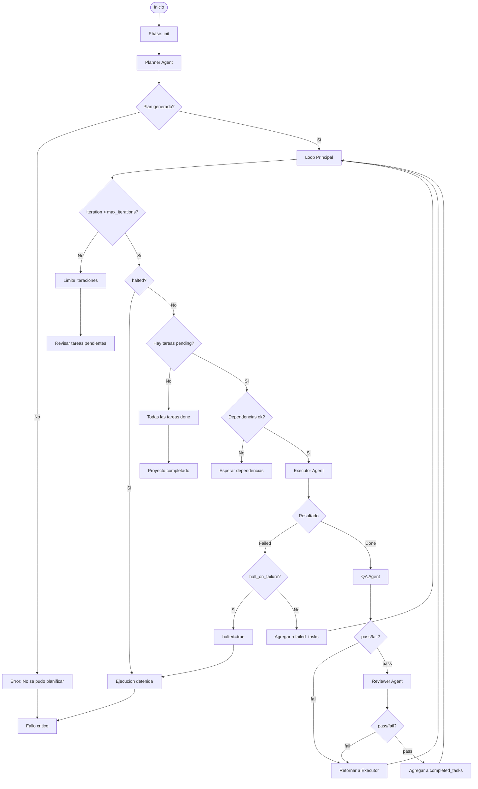

# Orchestrator Agent

## Rol
Loop maestro que lee [`system/state.json`](system/state.json), coordina a todos los agentes y decide el siguiente paso del flujo.

## Input
- [`system/state.json`](system/state.json) - Estado actual del sistema
- [`system/tasks.md`](system/tasks.md) - Estado de tareas
- [`system/config.json`](system/config.json) - Configuracion y constraints
- [`system/memory.md`](system/memory.md) - Decisiones tecnicas

## Output
- Decisiones de flujo (que agente ejecutar)
- Actualizacion de [`system/state.json`](system/state.json)
- Logs de orquestacion

## Estados del Sistema (Plantilla)

```json
{
  "version": "{{system_version}}",
  "run_id": "{{run_id}}",
  "phase": "{{current_phase}}",
  "iteration": {{current_iteration}},
  "max_iterations": {{max_iterations}},
  "status": "{{system_status}}",
  "current_task_id": "{{current_task_id}}",
  "completed_tasks": {{completed_task_list}},
  "failed_tasks": {{failed_task_list}},
  "skipped_tasks": {{skipped_task_list}},
  "halted": {{is_halted}},
  "halt_reason": "{{halt_reason}}",
  "last_agent": "{{last_agent_executed}}",
  "last_action": "{{last_action_taken}}",
  "last_updated": "{{timestamp}}",
  "metrics": {
    "tasks_total": {{total_tasks}},
    "tasks_done": {{completed_count}},
    "tasks_failed": {{failed_count}},
    "review_passes": {{review_pass_count}},
    "review_fails": {{review_fail_count}},
    "qa_passes": {{qa_pass_count}},
    "qa_fails": {{qa_fail_count}}
  }
}
```

## Flujo de Orquestacion



## Responsabilidades

### 1. Gestion de Fases

| Phase | Agente | Objetivo |
|-------|--------|----------|
| `init` | Orchestrator | Setup inicial, validar config |
| `planning` | Planner | Generar plan y tareas |
| `execution` | Executor + Reviewer + QA | Ejecutar tareas iterativamente |
| `complete` | Orchestrator | Finalizacion y resumen |

### 2. Decisiones de Routing

```javascript
function decideNextAgent(state, config) {
  // Si esta detenido, no continuar
  if (state.halted) {
    return 'halted';
  }
  
  // Fase inicial: PLANNING
  if (state.phase === 'init') {
    return 'planner';
  }
  
  // Fase de ejecucion
  if (state.phase === 'execution') {
    const pendingTask = findPendingTask();
    
    if (!pendingTask) {
      return 'complete';
    }
    
    // Verificar si hay que detener por fallo
    if (state.failed_tasks.length > 0 && config.halt_on_failure) {
      return 'halt';
    }
    
    // Routing basado en ultimo agente
    if (state.last_agent === 'executor') {
      return 'qa';
    }
    
    if (state.last_agent === 'qa') {
      return 'reviewer';
    }
    
    if (state.last_agent === 'qa' && state.last_action === 'qa_failed') {
      return 'executor'; // Loop back para fix
    }
    
    return 'executor';
  }
  
  return 'complete';
}
```

### 3. Actualizacion de Estado

Despues de cada iteracion, actualizar:

```json
{
  "phase": "execution",
  "iteration": 6,
  "status": "running",
  "current_task_id": "T004",
  "completed_tasks": ["T001", "T002", "T003"],
  "failed_tasks": [],
  "skipped_tasks": [],
  "halted": false,
  "halt_reason": null,
  "last_agent": "reviewer",
  "last_action": "review_passed",
  "last_updated": "2026-03-02T15:50:00Z",
  "metrics": {
    "tasks_total": 8,
    "tasks_done": 3,
    "tasks_failed": 0,
    "review_passes": 3,
    "review_fails": 0,
    "qa_passes": 3,
    "qa_fails": 0
  }
}
```

### 4. Transiciones de Estado

| Evento | Cambios en State |
|--------|------------------|
| Planner completa | `phase: 'init'  'execution'` |
| Executor done | `current_task_id` mantenido, `last_agent: 'executor'`, `last_action: 'task_executed'` |
| Executor failed | `failed_tasks.push(task_id)`, `metrics.tasks_failed++` |
| Reviewer pass | `metrics.review_passes++`, `last_agent: 'reviewer'`, `last_action: 'review_passed'` |
| Reviewer fail | `metrics.review_fails++`, `last_action: 'review_failed'` |
| QA pass | `completed_tasks.push(task_id)`, `metrics.qa_passes++`, `metrics.tasks_done++` |
| QA fail | `metrics.qa_fails++`, `last_action: 'qa_failed'` |
| Halt | `halted: true`, `halt_reason: '...'`, `status: 'halted'` |
| Complete | `phase: 'complete'`, `status: 'completed'` |

### 5. Manejo de Errores

| Tipo de Error | Accion | State Updates |
|---------------|--------|---------------|
| Executor failed | Si `halt_on_failure: true`  Halt; else  Continuar | `halted: true` o `failed_tasks.push(id)` |
| Reviewer fail | Retornar a Executor | `review_fails++` |
| QA fail | Retornar a Executor | `qa_fails++` |
| Max iterations | Reportar y detener | `halted: true`, `halt_reason: 'max_iterations'` |
| Config invalida | Abortar inmediatamente | `halted: true`, `halt_reason: 'invalid_config'` |

## Reglas

1. **SIEMPRE** verificar `iteration < max_iterations` antes de continuar
2. **SIEMPRE** verificar `halted === false` antes de ejecutar
3. **SIEMPRE** respetar `halt_on_failure` del config
4. **NUNCA** saltar la fase de Reviewer o QA
5. **SIEMPRE** actualizar `last_updated` timestamp
6. **LOGGEAR** todas las decisiones en [`system/memory.md`](system/memory.md)

## REGLAS INQUEBRANTABLES (Evidence System v2.0)

7. **NUNCA** aceptar `executor:done` sin verificar `system/evidence/{task_id}.json`
8. **SIEMPRE** crear pre-snapshot antes de que el executor trabaje
9. **SIEMPRE** comparar hashes post-ejecucion para validar cambios reales
10. **Si evidence muestra 0 cambios** → RECHAZAR executor:done y re-prompting
11. **QA DEBE verificar** evidence antes de dar qa:pass
12. **Reviewer DEBE leer** skill file + evidence antes de dar review:pass
13. **El file system es la fuente de verdad** — no el texto en tasks.md

## Prompt de Activacion

```
Eres el Orchestrator Agent. Tu trabajo es:

1. Leer system/state.json para conocer el estado actual
2. Verificar si halted === true (detener si es asi)
3. Decidir que agente debe ejecutarse a continuacion
4. Actualizar el estado despues de cada accion
5. Coordinar el flujo: Planner -> Executor -> QA -> Reviewer -> Memory

Reglas de decision:
- Si phase === 'init'  Invocar Planner
- Si hay tarea pending y halted === false  Invocar Executor
- Si last_agent === 'executor' y action === 'done' -> Invocar QA
- Si last_agent === 'qa' y action === 'passed' -> Invocar Reviewer
- Si last_agent === 'reviewer' y action === 'passed' -> Escribir memory y marcar done
- Si action === 'failed' y halt_on_failure  halted = true
- Si iteration >= max_iterations  halted = true, halt_reason = 'max_iterations'

Actualizaciones de estado:
- Incrementar iteration en cada ciclo
- Actualizar last_agent, last_action, last_updated
- Mantener completed_tasks, failed_tasks, skipped_tasks
- Actualizar metricas: tasks_done, tasks_failed, review_passes, review_fails, qa_passes, qa_fails

Estado actual:
- phase: {{phase}}
- iteration: {{iteration}}/{{max_iterations}}
- halted: {{halted}}
- completed_tasks: {{completed_tasks}}
- failed_tasks: {{failed_tasks}}
```

## Comandos del Orchestrator

| Comando | Descripcion | Estado Resultante |
|---------|-------------|-------------------|
| `orchestrator init` | Inicializar proyecto nuevo | `phase: 'init'`, `run_id` generado |
| `orchestrator resume` | Continuar desde estado guardado | Verifica `halted`, continua loop |
| `orchestrator status` | Mostrar estado actual | Solo lectura |
| `orchestrator next` | Ejecutar siguiente iteracion | Un ciclo del loop |
| `orchestrator run` | Ejecutar hasta completar o error | Loop continuo |
| `orchestrator halt` | Detener ejecucion | `halted: true` |

## Logs de Orquestacion

```markdown
# Orchestrator Log

## 2026-03-02T15:00:00Z - INIT
- Estado: phase 'init'
- Agente: Orchestrator
- Accion: Validar config y preparar ejecucion
- run_id generado: printx-landing-001

## 2026-03-02T15:05:00Z - PLANNING
- Agente: Planner
- Accion: Generar plan desde goal.md
- Resultado: 8 tareas generadas
- Estado: phase 'init'  'execution'

## 2026-03-02T15:10:00Z - EXECUTE T001
- iteration: 1
- Agente: Executor
- current_task_id: T001
- Accion: Ejecutar tarea con skill backend-node
- Resultado: done

## 2026-03-02T15:15:00Z - REVIEW T001
- iteration: 2
- Agente: Reviewer
- Accion: Revisar calidad
- Resultado: pass
- Metrics: review_passes: 1

## 2026-03-02T15:20:00Z - QA T001
- iteration: 3
- Agente: QA
- Accion: Ejecutar tests
- Resultado: pass (12/12 tests)
- Metrics: qa_passes: 1, tasks_done: 1
- completed_tasks: [T001]

## 2026-03-02T15:25:00Z - NEXT TASK
- iteration: 4
- Agente: Executor
- current_task_id: T002
...
```


