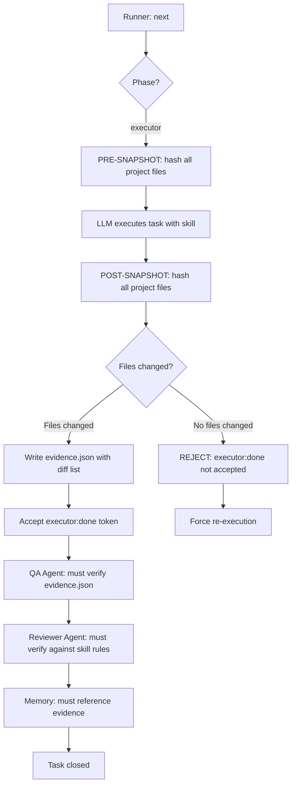

# Plan: Enforce Real Execution — No Skips, No Fakes

## Problem

The runner.js is a **state orchestrator only**. It tracks which agent should run next via tokens in `tasks.md` (`executor:done`, `qa:pass`, `review:pass`), but it has **zero verification** that real work was done. Any LLM can simply edit the `resultado` column in `tasks.md` and "complete" tasks without touching a single project file.

## Root Causes

1. **No evidence requirement**: The runner accepts `executor:done` as a plain text token — no proof of file changes needed.
2. **No file-change tracking**: There's no snapshot before/after execution to detect what actually changed.
3. **QA/Reviewer are advisory only**: They check code quality in theory, but nothing forces them to verify that files were actually modified.
4. **Memory entries are free-text**: Any LLM can write a plausible-sounding memory entry without doing real work.

## Solution Architecture



## Changes Required

### 1. New File: `system/evidence.json` (per-task execution proof)

Created automatically by the runner before accepting `executor:done`. Structure:

```json
{
  "task_id": "T001",
  "pre_snapshot": "2026-03-02T22:00:00Z",
  "post_snapshot": "2026-03-02T22:05:00Z",
  "files_changed": [
    {
      "path": "src/components/HeroSection.tsx",
      "action": "modified",
      "lines_added": 45,
      "lines_removed": 12
    }
  ],
  "files_created": ["src/components/PremiumCard.tsx"],
  "files_deleted": [],
  "total_changes": 3,
  "skill_used": "frontend-design-taste",
  "verified": false
}
```

### 2. Modify `runner.js` — Anti-Skip Guards

#### 2a. Add `evidence_required` flag to state

In `initializeState()`, add:
```javascript
evidence_required: true  // UNBREAKABLE RULE
```

#### 2b. New function: `validateExecutionEvidence(taskId, projectDir)`

Before accepting `executor:done`, the runner must:
1. Read `system/evidence/{taskId}.json`
2. Verify `files_changed.length > 0` OR `files_created.length > 0`
3. If no evidence file exists or no changes detected → **REJECT** the token and re-prompt executor

#### 2c. New function: `createPreSnapshot(projectDir)`

Before executor runs:
1. Scan the target project directory
2. Hash all source files (`.tsx`, `.ts`, `.js`, `.css`, `.md`, etc.)
3. Save to `system/evidence/{taskId}-pre.json`

#### 2d. New function: `createPostSnapshot(projectDir)` and `diffSnapshots()`

After executor claims done:
1. Re-scan and hash
2. Compare with pre-snapshot
3. Generate `system/evidence/{taskId}.json` with the diff

#### 2e. Modify execution flow in `orchestrate()`

Current flow (line ~614):
```javascript
if (!hasToken(task.resultado, 'executor:done')) {
  // just re-prompt executor
}
```

New flow:
```javascript
if (hasToken(task.resultado, 'executor:done')) {
  const evidence = readEvidence(task.id);
  if (!evidence || evidence.total_changes === 0) {
    // STRIP the executor:done token
    // Re-prompt executor with WARNING
    console.log('[REJECT] executor:done rejected — no file changes detected');
    return false;
  }
}
```

### 3. Modify `agents/executor.md` — Require Evidence Output

Add to the executor agent's rules:

```markdown
## UNBREAKABLE RULES
1. You MUST make REAL changes to project source files
2. You MUST list every file you created/modified in your output
3. You MUST NOT just edit tasks.md resultado — the runner will REJECT your work
4. The runner tracks file hashes before and after your execution
5. If zero project files changed, your executor:done token is automatically stripped
6. You MUST read the assigned skill file and apply its specific rules to the code
```

Add to output format:
```markdown
## Evidence
**Files Modified:** [list of actual files changed]
**Files Created:** [list of new files]
**Skill Applied:** [skill name] — [specific rules followed]
**Lines Changed:** [approximate count]
```

### 4. Modify `agents/qa.md` — Verify Evidence Exists

Add to QA agent's checks:

```markdown
## UNBREAKABLE RULES
1. Before running any quality checks, verify system/evidence/{task_id}.json exists
2. If evidence.json shows 0 file changes → automatic qa:fail
3. You MUST open and inspect the actual changed files listed in evidence.json
4. You MUST NOT pass a task that only changed tasks.md or system files
```

### 5. Modify `agents/reviewer.md` — Validate Against Skill

Add to reviewer agent's rules:

```markdown
## UNBREAKABLE RULES
1. Read the skill file assigned to this task
2. Read the evidence.json for this task
3. Open each changed file and verify the skill's rules were applied
4. For premium skills (design-taste, design-awwwards):
   - Verify typography rules were followed
   - Verify color rules were followed
   - Verify layout rules were followed
   - Verify anti-patterns were avoided
5. Score MUST reflect actual code quality, not just task completion
6. If evidence.json is missing or empty → automatic review:fail(score=0)
```

### 6. New Directory: `system/evidence/`

Structure:
```
system/evidence/
  T001-pre.json     # Pre-execution file hashes
  T001.json         # Post-execution evidence (diff)
  T002-pre.json
  T002.json
  ...
```

### 7. Modify `system/config.json` — Add Evidence Config

```json
{
  "evidence": {
    "required": true,
    "min_files_changed": 1,
    "excluded_paths": ["system/", ".agents/", "node_modules/", ".git/"],
    "tracked_extensions": [".tsx", ".ts", ".js", ".jsx", ".css", ".scss", ".html", ".json", ".md"],
    "project_root": null
  }
}
```

`project_root` is set at runtime via `runner.js start` or config. When `null`, the runner prompts for it.

### 8. Modify `runner.js` — New CLI Option

```bash
node runner.js start "goal" --project-root="/path/to/project"
```

Or in config.json:
```json
"project_root": "E:\\Carlos\\Development Tools\\Proyectos\\Ehdu"
```

### 9. Execution Log Enhancement

Each run already creates `system/runs/<run_id>/events.log`. Enhance it to include:

```
2026-03-02T22:05:00Z | evidence_validated | task=T001 | files_changed=3 | skill=frontend-design-taste
2026-03-02T22:05:01Z | executor_accepted | task=T001 | evidence=system/evidence/T001.json
```

Or if rejected:
```
2026-03-02T22:05:00Z | evidence_rejected | task=T001 | reason=no_file_changes | executor:done_stripped=true
```

### 10. Update `CHAT_PROMPT_TEMPLATE.md`

Add the unbreakable rule to the prompt template so every LLM session knows:

```text
CRITICAL RULES:
- The runner tracks file hashes before and after each task execution
- If you claim executor:done but no project files changed, the token is REJECTED
- You MUST make REAL code changes to the project files
- You MUST read and apply the assigned skill file's rules
- QA and Reviewer will verify actual file changes exist
```

## Implementation Order

1. Add `system/evidence/` directory and evidence schema
2. Add snapshot/diff functions to `runner.js`
3. Add anti-skip validation in `orchestrate()` execution flow
4. Update `agents/executor.md` with unbreakable rules
5. Update `agents/qa.md` with evidence verification
6. Update `agents/reviewer.md` with skill validation
7. Add evidence config to `system/config.json`
8. Add `--project-root` CLI option to `runner.js`
9. Update `CHAT_PROMPT_TEMPLATE.md` and `USAGE.md`
10. Update `scripts/smoke-runner.js` to test evidence flow

## Key Principle

> **The runner is the gatekeeper.** No token is accepted without machine-verifiable evidence. The LLM cannot self-certify completion — the file system is the source of truth.
