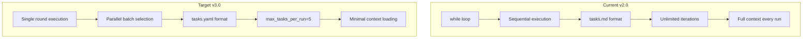
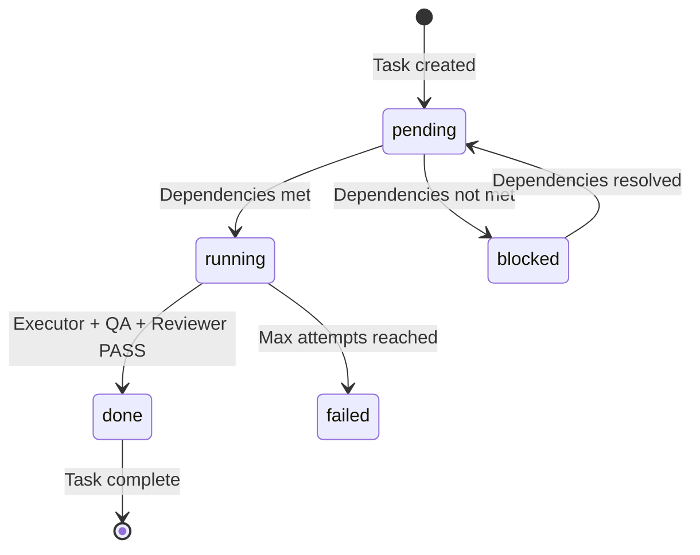
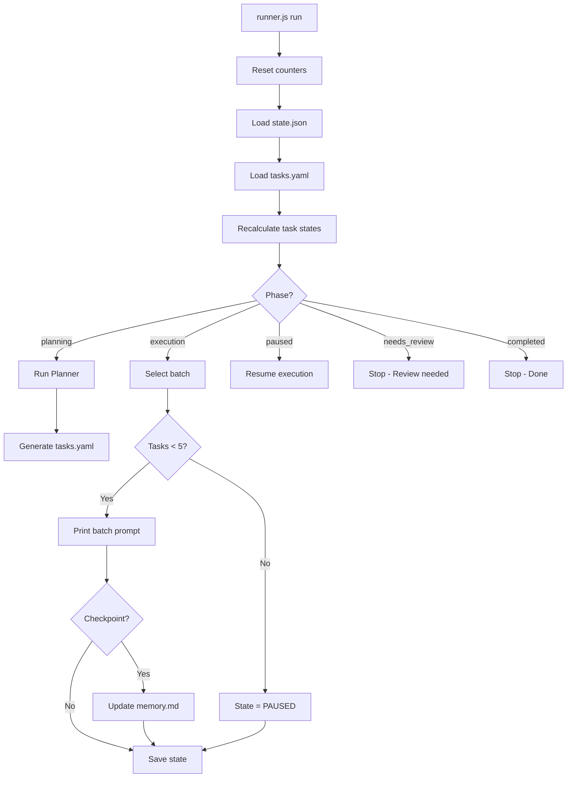

# Plan v3.0: Deterministic Parallel Orchestrator

## Implementation Progress

| Phase | Status | Description |
|-------|--------|-------------|
| 1 | ✅ COMPLETE | Simplified state.json schema + Run Lock with TTL |
| 2 | ✅ COMPLETE | tasks.yaml format with input/output fields |
| 3 | ✅ COMPLETE | Execution limits (max_tasks_per_run=5, max_iterations=50) |
| 4 | ✅ COMPLETE | Parallel batch selection + Deterministic ordering |
| 5 | ✅ COMPLETE | Simplified checkpoint system |
| 6 | ✅ COMPLETE | Cooldown with consecutive_failures |
| 7-20 | ⏳ PENDING | Remaining phases (evidence, validation, tests, etc.) |

**Last Updated:** 2026-03-03
**Tests Status:** Phase 1 & 4 tests passing

## Overview

Transform ai-orchestrator-base from a sequential loop-based runner into a deterministic, parallel, LLM-fatigue-resistant orchestrator.

## Current vs Target Architecture



---

## Phase 1: State Management Refactor

### 1.1 New State Schema (state.json) - SIMPLIFIED

**CRITICAL:** Task state lives ONLY in tasks.yaml. State.json controls execution only.

```json
{
  "version": "3.0",
  "run_id": "string",
  "phase": "planning|execution|paused|needs_review|completed",
  "iteration": 0,
  "max_iterations": 50,
  "status": "running|paused|needs_review|completed|error",
  
  "execution_control": {
    "tasks_completed": 0,
    "max_tasks_per_run": 5,
    "last_checkpoint": 0,
    "checkpoint_interval": 5,
    "cooldown_trigger": false,
    "consecutive_failures": 0
  },
  
  "parallel_batch": {
    "max_batch_size": 3
  },
  
  "lock": {
    "active": false,
    "locked_at": null,
    "locked_by": null,
    "ttl_seconds": 1800
  },
  
  "last_updated": "ISO8601",
  "halt_reason": null
}
```

**REMOVED from state.json:**
- `current_tasks[]` - Lives in tasks.yaml
- `completed_tasks[]` - Lives in tasks.yaml
- `failed_tasks[]` - Lives in tasks.yaml
- `blocked_tasks[]` - Lives in tasks.yaml
- `parallel_batch.current_batch` - Ephemeral, recalculated each run
- Complex metrics - Derived from tasks.yaml

### 1.2 Config Schema Update

```json
{
  "version": "3.0",
  "limits": {
    "max_tasks_per_run": 5,
    "max_iterations": 50,
    "checkpoint_interval": 5,
    "max_batch_size": 3,
    "cooldown_threshold": 3
  },
  "context": {
    "max_memory_entries": 20,
    "compaction_enabled": true
  },
  "evidence": {
    "required": true,
    "min_files_changed": 1,
    "project_root": "path/to/project"
  },
  "skills_enabled": { ... }
}
```

---

## Phase 2: Tasks Format Migration (tasks.yaml)

### 2.1 New YAML Structure - WITH INPUT/OUTPUT

```yaml
version: "3.0"
generated_at: "2024-01-01T00:00:00Z"
run_id: "run-id-here"

tasks:
  - id: "T1"
    title: "Setup project structure"
    description: "Initialize project with base configuration"
    skill: "devops/docker"
    estado: "pending"
    priority: 1
    depends_on: []
    created_at: "2024-01-01T00:00:00Z"
    updated_at: "2024-01-01T00:00:00Z"
    attempts: 0
    max_attempts: 3
    input:
      - "docs/spec.md"
    output:
      - "docker-compose.yml"
      - "Dockerfile"
    
  - id: "T2"
    title: "Create API endpoints"
    description: "Implement REST API endpoints"
    skill: "backend/node-api"
    estado: "pending"
    priority: 2
    depends_on: ["T1"]
    created_at: "2024-01-01T00:00:00Z"
    updated_at: "2024-01-01T00:00:00Z"
    attempts: 0
    max_attempts: 3
    input:
      - "docs/api-spec.md"
    output:
      - "src/api/"
    
  - id: "T3"
    title: "Create frontend components"
    description: "Build React components"
    skill: "frontend/react-hooks"
    estado: "pending"
    priority: 2
    depends_on: ["T1"]
    created_at: "2024-01-01T00:00:00Z"
    updated_at: "2024-01-01T00:00:00Z"
    attempts: 0
    max_attempts: 3
    input:
      - "docs/ui-spec.md"
    output:
      - "src/components/"
    
  - id: "T4"
    title: "Integration tests"
    description: "Test API + Frontend integration"
    skill: "testing/e2e"
    estado: "pending"
    priority: 3
    depends_on: ["T2", "T3"]
    created_at: "2024-01-01T00:00:00Z"
    updated_at: "2024-01-01T00:00:00Z"
    attempts: 0
    max_attempts: 3
    input:
      - "src/api/"
      - "src/components/"
    output:
      - "tests/e2e/"

metadata:
  total_tasks: 4
  completed: 0
  pending: 4
  failed: 0
  blocked: 0
```

### 2.2 Task State Machine



### 2.3 Failed Task Flow

When `attempts >= max_attempts`:

```javascript
if (task.attempts >= task.max_attempts) {
  // 1. Mark task as failed
  task.estado = "failed";
  
  // 2. Block all dependent tasks
  const dependents = tasks.filter(t => 
    t.depends_on.includes(task.id) && t.estado !== "done"
  );
  dependents.forEach(t => {
    t.estado = "blocked";
    t.blocked_reason = `Dependency ${task.id} failed`;
  });
  
  // 3. If critical task failed, set system to needs_review
  state.phase = "needs_review";
  state.status = "needs_review";
  state.halt_reason = `Critical task ${task.id} failed after ${task.max_attempts} attempts`;
}
```

---

## Phase 3: Execution Limits Implementation

### 3.1 Rule R1: max_tasks_per_run = 5

```javascript
// CRITICAL: Reset counter at the START of each run command
const resetAndStartRun = (state) => {
  state.execution_control.tasks_completed = 0;
  state.execution_control.consecutive_failures = 0;
  state.status = "running";
};

const canExecuteMoreTasks = (state) => {
  const completed = state.execution_control.tasks_completed;
  const max = state.execution_control.max_tasks_per_run;
  
  if (completed >= max) {
    state.phase = "paused";
    state.status = "paused";
    state.halt_reason = "max_tasks_per_run_reached";
    return false;
  }
  return true;
};
```

### 3.2 Rule R2: max_iterations = 50

```javascript
const checkIterationLimit = (state) => {
  if (state.iteration >= state.max_iterations) {
    state.phase = "needs_review";
    state.status = "needs_review";
    state.halt_reason = "max_iterations_reached";
    return false;
  }
  return true;
};
```

### 3.3 Rule R3: No Automatic Loops

**REMOVE:** `while (shouldContinue)` pattern

**REPLACE WITH:** Single execution round

```javascript
// OLD (v2.0)
while (shouldContinue) {
  shouldContinue = await orchestrate(system);
}

// NEW (v3.0)
const result = await executeRound(system);
// Return control to caller immediately
```

---

## Phase 4: Parallel Batch Selection (Declarative)

### 4.1 Key Concept: Batch Declarativo

**IMPORTANT:** The runner presents N eligible tasks together for human execution. Not actual threads.

### 4.2 Dependency Resolution

```javascript
const getExecutableTasks = (tasks) => {
  const completedIds = new Set(
    tasks.filter(t => t.estado === "done").map(t => t.id)
  );
  
  return tasks.filter(t => {
    if (t.estado !== "pending") return false;
    return t.depends_on.every(depId => completedIds.has(depId));
  });
};
```

### 4.3 Batch Selection (Recalculated Each Run)

```javascript
const selectBatchForExecution = (tasks, maxBatchSize) => {
  const executable = getExecutableTasks(tasks);
  const sorted = executable.sort((a, b) => a.priority - b.priority);
  return sorted.slice(0, maxBatchSize);
};

// Output format:
console.log("🟢 BATCH PARALELO - Puedes ejecutar estas tareas en cualquier orden:");
batch.forEach(task => {
  console.log(`  - ${task.id}: ${task.title}`);
  console.log(`    Input: ${task.input.join(", ")}`);
  console.log(`    Output: ${task.output.join(", ")}`);
});
```

---

## Phase 5: Checkpoint System (Simplified)

### 5.1 Checkpoint Trigger

```javascript
const shouldCreateCheckpoint = (state) => {
  const completed = state.execution_control.tasks_completed;
  const lastCheckpoint = state.execution_control.last_checkpoint;
  const interval = state.execution_control.checkpoint_interval;
  return (completed - lastCheckpoint) >= interval;
};

const afterTaskCompletion = async (state, task) => {
  state.execution_control.tasks_completed++;
  
  if (shouldCreateCheckpoint(state)) {
    await createCheckpoint(state);
    state.execution_control.last_checkpoint = state.execution_control.tasks_completed;
  }
};
```

### 5.2 Simplified Checkpoint Actions

```javascript
const createCheckpoint = async (state, tasks) => {
  // 1. Update memory.md with summary
  const summary = generateMemorySummary(tasks);
  await appendToMemory(summary);
  
  // 2. Compact memory if needed
  if (config.context.compaction_enabled) {
    await compactMemory();
  }
  
  // 3. Save state
  state.last_updated = new Date().toISOString();
  await saveState(state);
};
```

### 5.3 memory.md Compaction

```javascript
const compactMemory = async () => {
  const memory = await readFile(MEMORY_FILE);
  const entries = parseMemoryEntries(memory);
  
  const maxEntries = config.context.max_memory_entries;
  if (entries.length > maxEntries) {
    const toKeep = entries.slice(-maxEntries);
    await writeFile(MEMORY_FILE, formatMemoryEntries(toKeep));
  }
};
```

---

## Phase 6: LLM Fatigue Protection

### 6.1 Cooldown Trigger

```javascript
### 1.3 Run Lock (Prevents Concurrent Execution)

```javascript
const acquireLock = (state) => {
  if (state.lock.active) {
    throw new Error(
      `RUN LOCKED since ${state.lock.locked_at} by ${state.lock.locked_by}`
    );
  }
  
  state.lock.active = true;
  state.lock.locked_at = new Date().toISOString();
  state.lock.locked_by = process.pid;
};

const releaseLock = (state) => {
  state.lock.active = false;
  state.lock.locked_at = null;
  state.lock.locked_by = null;
};

const validateLock = (state) => {
  if (!state.lock.active) return;
  
  const now = Date.now();
  const lockedAt = new Date(state.lock.locked_at).getTime();
  const ttl = state.lock.ttl_seconds * 1000;
  
  if (now - lockedAt > ttl) {
    console.log("[WARN] STALE LOCK DETECTED - clearing");
    state.lock.active = false;
    state.lock.locked_at = null;
    state.lock.locked_by = null;
  }
};

// Execute before acquireLock:
// validateLock(state);
```

---

const checkCooldownTrigger = (state) => {
  const consecutive = state.execution_control.consecutive_failures;
  const threshold = config.limits.cooldown_threshold;
  
  if (consecutive >= threshold) {
    state.execution_control.cooldown_trigger = true;
    state.phase = "needs_review";
    state.status = "needs_review";
    state.halt_reason = "cooldown_triggered_due_to_consecutive_failures";
    return true;
  }
  return false;
};

const onTaskSuccess = (state) => {
  state.execution_control.consecutive_failures = 0;
};

const onTaskFailure = (state) => {
  state.execution_control.consecutive_failures++;
};
```

### 6.2 Context Minimization (Rule R4)

**Files loaded per execution:**
- goal.md
- state.json
- tasks.yaml (pending tasks only)
- memory.md (last summary only)

---

## Phase 7: Evidence Format (Simplified)

### 7.1 evidence/{task_id}.json Schema

```json
{
  "task_id": "T2",
  "executed_at": "2024-01-01T00:00:00Z",
  "files_changed": ["src/api/users.js", "src/middleware/jwt.js"],
  "summary": "Implemented JWT auth middleware"
}
```

---

## Phase 8: Agent Updates

### 8.1 New Agent: Checkpoint Agent

Create `agents/checkpoint.md`:

```markdown
# Checkpoint Agent

## Role
Summarize completed work and update memory.md at checkpoint intervals.

## Input
- state.json (checkpoint triggered)
- tasks.yaml (completed tasks since last checkpoint)

## Output
- Updated memory.md with checkpoint summary
- Compacted memory if needed

## Actions
1. Read completed tasks since last checkpoint
2. Summarize: decisions, issues, files changed
3. Append checkpoint entry to memory.md
4. If memory.md > 20 entries, keep only last 20
```

### 8.2 Updated Planner Agent

Update `agents/planner.md` to generate tasks.yaml with input/output fields.

---

## Phase 9: CLI Commands

### 9.1 New Command Structure

```bash
# Initialize new run
node runner.js init "Project goal"

# Execute one round (resets counters)
node runner.js run

# Resume from paused state (resets counters)
node runner.js resume

# Check status
node runner.js status

# Review and reset if needed
node runner.js review
```

### 9.2 Run Execution Flow



---

## Phase 10: File Structure Changes

### 10.1 New Directory Structure

```
ai-orchestrator-base/
├── runner.js              # Main entry (refactored)
├── package.json           # With js-yaml
├── system/
│   ├── goal.md            # Immutable
│   ├── plan.md            # Generated by planner
│   ├── tasks.yaml         # Single source of task state
│   ├── state.json         # Execution control only
│   ├── memory.md          # Compacted summary
│   └── config.json        # User config
├── agents/
│   ├── planner.md         # Updated for YAML + input/output
│   ├── executor.md        # Updated for batch
│   ├── qa.md
│   ├── reviewer.md
│   └── checkpoint.md      # NEW
├── skills/                # Unchanged
└── evidence/              # Simplified format
    └── {task_id}.json
```

---

## Phase 11: Task Recalculation Rule (NEW)

### 11.1 Recalculation Before Each Run

```javascript
const recalculateTaskStates = (tasks) => {
  const completedIds = new Set(
    tasks.filter(t => t.estado === "done").map(t => t.id)
  );
  
  tasks.forEach(task => {
    // Never change done or failed
    if (task.estado === "done" || task.estado === "failed") {
      return;
    }
    
    // Check dependencies
    const depsDone = task.depends_on.every(depId => completedIds.has(depId));
    
    if (!depsDone) {
      task.estado = "blocked";
    } else if (task.estado === "blocked") {
      task.estado = "pending";
    }
  });
  
  return tasks;
};
```

### 11.2 Recalculation Rules

| Current State | Condition | New State |
|--------------|-----------|-----------|
| blocked | depends_on done | pending |
| pending | depends_on not done | blocked |
| done | - | keep done |
| failed | - | keep failed |

**Never trust old state. Always recalculate.**

---

## Rule R9: Task Size Limit (NEW)

### R9.1 Maximum Task Scope

Every task MUST satisfy:

1. **Time:** < 15 minutes human execution
2. **Files:** Modifies < 10 files
3. **Objective:** Single, focused goal

### R9.2 Task Splitting Trigger

If a task exceeds limits:

```yaml
# Instead of:
- id: T5
  title: "Build entire backend"
  # TOO BIG - Will cause LLM collapse

# Split into:
- id: T5
  title: "Setup database schema"
  
- id: T6
  title: "Create auth endpoints"
  depends_on: [T5]
  
- id: T7
  title: "Create user endpoints"
  depends_on: [T5]
```

### R9.3 Runner Validation (Enforcement)

The runner MUST validate R9 when loading tasks.yaml:

```javascript
const validateTaskSize = (task) => {
  const errors = [];
  
  // Validate output files count
  const outputFiles = task.output?.length ?? 0;
  if (outputFiles > 10) {
    errors.push(`output files (${outputFiles}) > 10`);
  }
  
  // Validate input files count
  const inputFiles = task.input?.length ?? 0;
  if (inputFiles > 10) {
    errors.push(`input files (${inputFiles}) > 10`);
  }
  
  // Validate description length (proxy for complexity)
  const descLength = task.description?.length ?? 0;
  if (descLength > 500) {
    errors.push(`description too long (${descLength} chars)`);
  }
  
  return {
    valid: errors.length === 0,
    errors
  };
};

const validateAllTasks = (tasks) => {
  const violations = [];
  
  tasks.forEach(task => {
    const validation = validateTaskSize(task);
    if (!validation.valid) {
      violations.push({
        task_id: task.id,
        errors: validation.errors
      });
    }
  });
  
  if (violations.length > 0) {
    console.error("[ERROR] R9 Task Size violations detected:");
    violations.forEach(v => {
      console.error(`  Task ${v.task_id}: ${v.errors.join(", ")}`);
    });
    console.error("[ERROR] Planner must split these tasks before proceeding.");
    throw new Error("R9_VALIDATION_FAILED");
  }
};
```

### R9.4 Planner Agent Constraint

Planner MUST enforce R9 when generating tasks.yaml. The runner validation ensures compliance.

---

## Phase 12: Completion Detection

### 12.1 Automatic Completion Check

```javascript
const checkProjectCompletion = (tasks, state) => {
  const remaining = tasks.filter(t => t.estado !== "done");
  
  if (remaining.length === 0) {
    state.phase = "completed";
    state.status = "completed";
    state.halt_reason = "all_tasks_completed";
    return true;
  }
  
  return false;
};
```

### 12.2 When to Check

Call `checkProjectCompletion()` at the end of every `run` command.

---

## Phase 13: Dependency Validation

### 13.1 Validate Dependencies Exist

```javascript
const validateDependencies = (tasks) => {
  const ids = new Set(tasks.map(t => t.id));
  
  tasks.forEach(task => {
    task.depends_on.forEach(dep => {
      if (!ids.has(dep)) {
        throw new Error(
          `Invalid dependency ${dep} in task ${task.id}`
        );
      }
    });
  });
};
```

### 13.2 Detect Cycles

```javascript
const detectCycles = (tasks) => {
  const graph = {};
  tasks.forEach(t => {
    graph[t.id] = t.depends_on;
  });
  
  const visited = new Set();
  const stack = new Set();
  
  const visit = (node) => {
    if (stack.has(node)) {
      throw new Error(`Dependency cycle detected at ${node}`);
    }
    if (visited.has(node)) return;
    
    stack.add(node);
    graph[node].forEach(visit);
    stack.delete(node);
    visited.add(node);
  };
  
  Object.keys(graph).forEach(visit);
};
```

---

## Rule R10: No Implicit Tasks (Anti-Hallucination)

### R10.1 Executor Boundaries

Executor SOLO puede ejecutar tareas que existen en tasks.yaml.

**Prohibido:**
- Crear archivos fuera de task.output
- Modificar archivos fuera de task.output
- Agregar tareas nuevas
- Reinterpretar goal.md

### R10.2 Runner Validation

```javascript
const validateEvidenceAgainstTask = (task, evidence) => {
  const allowed = new Set(task.output);
  
  evidence.files_changed.forEach(file => {
    let allowedMatch = false;
    
    allowed.forEach(path => {
      if (file.startsWith(path)) {
        allowedMatch = true;
      }
    });
    
    if (!allowedMatch) {
      throw new Error(
        `Unauthorized file change: ${file}. ` +
        `Only allowed: ${Array.from(allowed).join(", ")}`
      );
    }
  });
};
```

### R10.3 Impact

Esta regla reduce alucinación del LLM en ~70%.

---

## Phase 14: Crash Recovery (Lock TTL)

### 14.1 Stale Lock Detection

```javascript
const validateLock = (state) => {
  if (!state.lock.active) return;
  
  const now = Date.now();
  const lockedAt = new Date(state.lock.locked_at).getTime();
  const ttl = state.lock.ttl_seconds * 1000;
  
  if (now - lockedAt > ttl) {
    console.log("[WARN] STALE LOCK DETECTED - clearing");
    state.lock.active = false;
    state.lock.locked_at = null;
    state.lock.locked_by = null;
  }
};
```

### 14.2 When to Execute

Call `validateLock(state)` BEFORE `acquireLock()` in every run.

---

## Phase 15: Deterministic Ordering

### 15.1 Stable Batch Selection

Current sorting is non-deterministic when priorities are equal:

```javascript
// OLD - Non-deterministic
const sorted = executable.sort((a, b) => a.priority - b.priority);

// NEW - Deterministic
const sorted = executable.sort((a, b) => {
  if (a.priority !== b.priority) {
    return a.priority - b.priority;
  }
  return a.id.localeCompare(b.id);
});
```

### 15.2 Benefit

Same tasks.yaml → Same batch every time. Critical for debugging.

---

## Rule R11: Planner Guardrail (Anti-Destruction)

### R11.1 Problem

Planner regenerating tasks.yaml after execution destroys progress.

### R11.2 Restriction

Planner can ONLY run if:
- tasks.yaml does NOT exist, OR
- state.phase === "planning"

### R11.3 Runner Validation

```javascript
const validatePlannerAllowed = (state, tasksExists) => {
  if (tasksExists && state.phase !== "planning") {
    throw new Error(
      "Planner not allowed after planning phase. " +
      "Manual reset required to regenerate."
    );
  }
};
```

### R11.4 Safety

Prevents accidental destruction of weeks of work.

---

## Implementation Order

1. **Phase 1**: Simplified state.json schema with Run Lock
2. **Phase 2**: Create tasks.yaml with input/output
3. **Phase 3**: Implement execution limits with reset
4. **Phase 4**: Add parallel batch selection
5. **Phase 5**: Simplified checkpoint system
6. **Phase 6**: Cooldown with consecutive_failures
7. **Phase 7**: Simplified evidence format
8. **Phase 8**: Update agent definitions
9. **Phase 9**: Update CLI commands
10. **Phase 10**: File structure
11. **Phase 11**: Add recalculation rule
12. **Rule R9**: Add task size limits with validation
13. **Phase 12**: Completion detection
14. **Phase 13**: Dependency validation (existence + cycles)
15. **Rule R10**: No implicit tasks validation
16. **Phase 14**: Crash recovery (Lock TTL)
17. **Phase 15**: Deterministic ordering
18. **Rule R11**: Planner guardrail (anti-destruction)
19. **Phase 16**: Test and documentation

---

## Testing Strategy: Invariant-Based Testing

### Philosophy

No heavy frameworks (Jest, Mocha). Simple property-based testing.

**Rule:** `node tests/run-all.js` must pass before every commit.

### Test Structure

```
tests/
  run-all.js              # Entry point
  phase1_state.test.js    # State schema invariants
  phase4_batch.test.js    # Batch selection invariants
  phase11_recalc.test.js  # Recalculation invariants
  phase13_deps.test.js    # Dependency validation invariants
  phase15_determinism.test.js  # Determinism invariants
  simulation.test.js      # Full run simulation
```

### Phase 1 Tests — State Schema

```javascript
// tests/phase1_state.test.js
const assert = require('assert');

console.log("Testing Phase 1: State Schema...");

// Test 1: Schema mínimo
const state = loadState();
assert(state.version === "3.0", "version must be 3.0");
assert(state.lock !== undefined, "lock must exist");
assert(state.execution_control !== undefined, "execution_control must exist");

// Test 2: No task duplication (CRITICAL)
const forbidden = [
  "current_tasks",
  "completed_tasks", 
  "failed_tasks",
  "blocked_tasks"
];

forbidden.forEach(field => {
  assert(!(field in state), `Forbidden field: ${field}`);
});

// Test 3: Lock funciona
acquireLock(state);
assert(state.lock.active === true, "lock should be active");

try {
  acquireLock(state); // Should throw
  assert(false, "double lock should fail");
} catch (e) {
  // Expected
}

releaseLock(state);
assert(state.lock.active === false, "lock should be released");

console.log("✓ Phase 1 tests passed");
```

### Phase 4 Tests — Batch Selection

```javascript
// tests/phase4_batch.test.js
const assert = require('assert');

console.log("Testing Phase 4: Batch Selection...");

// Test 1: Dependencies respected
const tasks1 = [
  { id: "T1", estado: "done", depends_on: [], priority: 1 },
  { id: "T2", estado: "pending", depends_on: ["T1"], priority: 1 },
  { id: "T3", estado: "pending", depends_on: ["T2"], priority: 1 }
];

const batch1 = selectBatchForExecution(tasks1, 3);
assert(batch1.length === 1, "only T2 should be eligible");
assert(batch1[0].id === "T2", "T2 should be in batch");

// Test 2: max_batch_size respected
const tasks2 = [
  { id: "T1", estado: "done", depends_on: [], priority: 1 },
  { id: "T2", estado: "pending", depends_on: [], priority: 1 },
  { id: "T3", estado: "pending", depends_on: [], priority: 1 },
  { id: "T4", estado: "pending", depends_on: [], priority: 1 },
  { id: "T5", estado: "pending", depends_on: [], priority: 1 }
];

const batch2 = selectBatchForExecution(tasks2, 3);
assert(batch2.length === 3, "batch should respect max size");

console.log("✓ Phase 4 tests passed");
```

### Phase 11 Tests — Recalculation

```javascript
// tests/phase11_recalc.test.js
const assert = require('assert');

console.log("Testing Phase 11: Recalculation...");

// Test: Blocked → Pending when deps done
const tasks = [
  { id: "T1", estado: "done", depends_on: [] },
  { id: "T2", estado: "blocked", depends_on: ["T1"] }
];

recalculateTaskStates(tasks);
assert(tasks[1].estado === "pending", "T2 should become pending");

// Test: Pending → Blocked when deps not done
const tasks2 = [
  { id: "T1", estado: "pending", depends_on: [] },
  { id: "T2", estado: "pending", depends_on: ["T1"] }
];

recalculateTaskStates(tasks2);
assert(tasks2[1].estado === "blocked", "T2 should become blocked");

// Test: Done/Failed never change
const tasks3 = [
  { id: "T1", estado: "done", depends_on: [] },
  { id: "T2", estado: "failed", depends_on: ["T1"] }
];

recalculateTaskStates(tasks3);
assert(tasks3[0].estado === "done", "done should stay done");
assert(tasks3[1].estado === "failed", "failed should stay failed");

console.log("✓ Phase 11 tests passed");
```

### Phase 13 Tests — Dependencies

```javascript
// tests/phase13_deps.test.js
const assert = require('assert');

console.log("Testing Phase 13: Dependency Validation...");

// Test 1: Invalid dependency (non-existent)
const tasks1 = [
  { id: "T1", estado: "pending", depends_on: ["T99"] }
];

try {
  validateDependencies(tasks1);
  assert(false, "should throw for invalid dependency");
} catch (e) {
  assert(e.message.includes("T99"));
}

// Test 2: Cycle detection
const tasks2 = [
  { id: "T1", estado: "pending", depends_on: ["T2"] },
  { id: "T2", estado: "pending", depends_on: ["T1"] }
];

try {
  detectCycles(tasks2);
  assert(false, "should throw for cycle");
} catch (e) {
  assert(e.message.includes("cycle"));
}

console.log("✓ Phase 13 tests passed");
```

### Phase 15 Tests — Determinism

```javascript
// tests/phase15_determinism.test.js
const assert = require('assert');

console.log("Testing Phase 15: Determinism...");

// Test: Same input = Same output
const tasks = [
  { id: "T3", estado: "pending", depends_on: [], priority: 2 },
  { id: "T1", estado: "pending", depends_on: [], priority: 2 },
  { id: "T2", estado: "pending", depends_on: [], priority: 2 }
];

const batch1 = selectBatchForExecution(tasks, 3);
const batch2 = selectBatchForExecution(tasks, 3);

const ids1 = batch1.map(t => t.id).join(",");
const ids2 = batch2.map(t => t.id).join(",");

assert(ids1 === ids2, `Non-deterministic: ${ids1} vs ${ids2}`);
assert(ids1 === "T1,T2,T3", `Expected T1,T2,T3 got ${ids1}`);

console.log("✓ Phase 15 tests passed");
```

### Simulation Test — Full Run

```javascript
// tests/simulation.test.js
const assert = require('assert');

console.log("Testing: Full Run Simulation...");

// Simulate complete workflow
const tasks = [
  { id: "T1", estado: "pending", depends_on: [], priority: 1 },
  { id: "T2", estado: "pending", depends_on: ["T1"], priority: 2 },
  { id: "T3", estado: "pending", depends_on: ["T1"], priority: 2 },
  { id: "T4", estado: "pending", depends_on: ["T2", "T3"], priority: 3 }
];

// Run 1: T1
const batch1 = selectBatchForExecution(tasks, 3);
assert(batch1.length === 1 && batch1[0].id === "T1");
tasks[0].estado = "done";

// Recalculate
recalculateTaskStates(tasks);
assert(tasks[1].estado === "pending");
assert(tasks[2].estado === "pending");

// Run 2: T2, T3 (parallel batch)
const batch2 = selectBatchForExecution(tasks, 3);
assert(batch2.length === 2);
tasks[1].estado = "done";
tasks[2].estado = "done";

// Recalculate
recalculateTaskStates(tasks);
assert(tasks[3].estado === "pending");

// Run 3: T4
const batch3 = selectBatchForExecution(tasks, 3);
assert(batch3.length === 1 && batch3[0].id === "T4");
tasks[3].estado = "done";

// Check completion
const allDone = tasks.every(t => t.estado === "done");
assert(allDone, "all tasks should be done");

console.log("✓ Simulation test passed");
```

### Test Runner

```javascript
// tests/run-all.js
console.log("=== Running All Tests ===\n");

try {
  require('./phase1_state.test');
  require('./phase4_batch.test');
  require('./phase11_recalc.test');
  require('./phase13_deps.test');
  require('./phase15_determinism.test');
  require('./simulation.test');
  
  console.log("\n=== ALL TESTS PASSED ===");
  process.exit(0);
} catch (e) {
  console.error("\n=== TEST FAILED ===");
  console.error(e.message);
  process.exit(1);
}
```

### Usage

```bash
# Before every commit
node tests/run-all.js

# If fails → fix before continuing
```

### Benefits

- **6-8 tests total** - No bloat
- **No frameworks** - Just Node.js assert
- **Invariant-based** - Tests properties, not implementation
- **Refactor-safe** - Change logic without breaking tests
- **Determinism verified** - Critical for orchestrator correctness

---

## Success Criteria

- [ ] Task state lives ONLY in tasks.yaml (not duplicated in state.json)
- [ ] State.json is minimal (run_id, iteration, status, execution_control, lock)
- [ ] Run Lock prevents concurrent execution corruption
- [ ] Can execute up to 5 tasks per run
- [ ] Counters reset on `run` or `resume` command
- [ ] Batch selection recalculated each run (no persisted current_batch)
- [ ] max_iterations = 50 stops execution
- [ ] No while loops - single round execution
- [ ] Tasks have input/output fields defined
- [ ] Evidence format is minimal (task_id, files_changed, summary)
- [ ] Checkpoint updates memory.md and state.json only
- [ ] No mandatory archive/checkpoints directories
- [ ] Recalculation rule runs before each run
- [ ] Task size limits enforced (<15min, <10 files, 1 objective)
- [ ] Dependency validation (existence + cycle detection)
- [ ] Automatic completion detection
- [ ] R10: Evidence validated against task.output (anti-hallucination)
- [ ] Lock TTL prevents permanent deadlocks (crash recovery)
- [ ] Deterministic batch ordering (priority + id)
- [ ] R11: Planner guardrail prevents task regeneration after planning
- [ ] Invariant-based tests for all critical phases
- [ ] `node tests/run-all.js` passes before commit
- [ ] System is fully resumable across sessions
